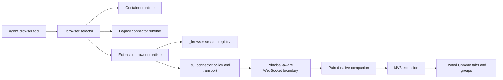

# Agent Zero Browser Bridge Core Adapter v1

Status: **Frozen architecture decision**  
Adapter contract: `a0.browser-bridge.adapter.v1`  
Canonical map: https://github.com/TerminallyLazy/agent-zero/issues/13  
Decision ticket: https://github.com/TerminallyLazy/agent-zero/issues/17  
Depends on: #14, #15, and #16

## 1. Scope

This document defines the Agent Zero Core boundary that makes a paired Chrome
extension a first-class implementation of the existing `_browser` tool. It
freezes:

- component ownership across `_browser`, `_a0_connector`, and shared WebSocket
  helpers;
- the authenticated WebSocket principal and event gate;
- stable backend discovery, selection, and codec dispatch;
- context, browser-session, turn, operation, control, event, and artifact state;
- normal completion, stop, nudge, reset, removal, reload, cancellation, and
  reconnect behavior;
- site policy, action approval, audit, and context redaction boundaries;
- Browser Settings status and API ownership;
- compatibility, implementation, test, and DOX obligations.

It does not implement production code. It also does not define the MV3 service
worker, tab-group implementation, cursor rendering, final side-panel layout, or
store-publishing assets. Those are later frontiers.

The terms MUST, MUST NOT, SHOULD, SHOULD NOT, and MAY are normative.

## 2. Verdict

1. Agent Zero retains one agent-facing `browser` tool. The extension does not
   add, wrap, or prompt for a second `chrome_bridge` tool.
2. `_browser` owns browser selection, the v1 browser runtime adapter,
   browser-session/turn lifecycle, policy invocation, result materialization,
   and the Browser Settings projection.
3. `_a0_connector` owns pairing and proof verification, durable bridge records,
   fixed scopes, event authorization, connector transport, context projection,
   artifacts, approvals, revocation, and bounded audit.
4. Shared `helpers/ws.py` and `helpers/ws_manager.py` gain a small generic,
   documented socket-principal seam. Both inbound dispatch and every outbound
   path enforce the principal's event allowlist. Bridge semantics remain
   plugin-local.
5. The existing top-level runtime modes remain `container` and `host_required`.
   A Chrome extension is a distinct typed host-browser backend selected by
   `host_browser_selection=extension:<bridge_id>`; it is not a third agent tool
   or an untyped legacy candidate.
6. An explicitly selected extension never falls back to container, A0 CLI CDP,
   another extension, or another socket. Existing unselected `host_required`
   behavior continues to consider legacy A0 CLI candidates only.
7. A bridge socket is authorized by its verified `browser_bridge` principal,
   never by `connector_hello` claims. Supplying bridge proof makes ambient
   cookies and API keys irrelevant and cannot upgrade the connection.
8. Legacy `ConnectorBrowserRuntime` and its flat payload remain intact. A new
   extension runtime emits only canonical `a0.browser-bridge.v1` payloads and
   dispatches only negotiated actions.
9. A durable browser-session registry is keyed by Agent Zero `context_id` and
   pinned to one `bridge_id`. A fresh `turn_id` is created per monologue or
   bounded synthetic tool run.
10. Cancellation and finalization are idempotent controls owned by a
    process-level dispatcher. Killing the task that requested cleanup must not
    kill cleanup delivery.
11. Transport loss never guesses that a mutation was canceled or that tabs were
    closed. Reconnect reconciles durable intent; uncertain mutation outcomes are
    `OUTCOME_UNKNOWN`.
12. Server site policy is checked before dispatch. The extension independently
    blocks unexpected origins and higher-risk actions. Consequential approvals
    are exact, expiring, one-operation receipts.
13. Binary data uses bounded, checksummed artifact frames and private spools.
    Results contain descriptors, never inline base64 or host paths.
14. `_browser/status` exposes a sanitized, layered extension status. A green
    server record cannot imply that a remote native host, extension, permission,
    or browser is healthy.
15. `agent.py` and `initialize.py` do not change. Lifecycle behavior uses plugin
    hooks and existing extensibility points.

## 3. Ownership and data flow



### 3.1 `_browser` owns

- the unchanged `browser` tool contract and response shape;
- effective browser configuration and stable selection;
- typed dispatch to container, legacy connector, or extension runtime;
- creation of `browser_session_id`, `turn_id`, `action_id`, `op_id`, and
  `control_id` where the frozen protocol assigns them to the server;
- per-context lifecycle intent and finalization dispositions;
- the server-side preflight call into site/action policy;
- conversion of verified artifact descriptors into existing chat-scoped media;
- the effective Browser Settings/status projection.

### 3.2 `_a0_connector` owns

- pairing create/status/cancel and public one-time exchange;
- bridge challenge creation and signed-proof verification;
- durable bridge public records, generations, revocation, and audit;
- the fixed scope-to-event map and WebSocket principal hook;
- bridge-only `connector_hello` normalization and capability registry;
- context authorization and purpose-built context/history projection;
- browser operation, control, event, approval, and artifact transport;
- bridge disconnect, replacement, and reconnect bookkeeping;
- policy and approval persistence.

### 3.3 Shared helpers own only reusable enforcement

`helpers/ws.py` owns construction of an immutable authenticated principal and
enforcement before handler dispatch. `helpers/ws_manager.py` owns principal
storage for a connection and enforcement before direct emit, broadcast,
buffering, and buffer replay.

Shared helpers do not parse Ed25519 proof objects, know browser scopes, store
pairing records, redact chat history, or decide site policy. Those behaviors
remain in `_a0_connector`.

## 4. Current source constraints

The implementation must account for these current behaviors:

- `_SecurityContext` contains session hash, CSRF values, remote address, and API
  key, but no principal (`helpers/ws.py:171-179`).
- clients currently provide arbitrary `auth.handlers`, which are loaded before
  inbound events fan into active handlers (`helpers/ws.py:476-637`);
- `ConnectionInfo` has no principal, while manager restart, direct emit,
  broadcast, buffering, and replay can reach any SID
  (`helpers/ws_manager.py:218-224`, `710-759`, `1201-1277`, `1291-1343`,
  `1385-1419`);
- connector hello currently trusts client-declared remote-tool metadata and
  returns general remote-tool/exec state
  (`plugins/_a0_connector/api/ws_connector.py:159-246`);
- browser pending operations are bound to a SID but not to bridge, session,
  turn, action, or extension load generation
  (`plugins/_a0_connector/helpers/ws_runtime.py:40-46`, `1016-1057`);
- host browser selection is untyped and can choose a context, Launcher, or
  global SID (`plugins/_a0_connector/helpers/ws_runtime.py:383-401`);
- `ConnectorBrowserRuntime` emits a legacy flat payload and performs
  CDP/profile preparation (`plugins/_browser/helpers/connector_runtime.py:124-230`,
  `291-316`);
- `_browser` creates a new connector runtime per tool call, so runtime-object
  memory cannot own a browser session (`plugins/_browser/helpers/selector.py:17-43`);
- Browser Settings filters candidates without a CDP endpoint and polls a single
  summarized status (`plugins/_browser/webui/browser-config-store.js:275`,
  `369-418`);
- the generic connector event projection copies Browser log metadata, while the
  Browser tool logs raw arguments (`plugins/_a0_connector/helpers/event_bridge.py:27-76`,
  `plugins/_browser/tools/browser.py:319-326`).

These are insertion constraints, not permission to reuse their broader
authority for a bridge principal.

## 5. Socket principal contract

### 5.1 Immutable principal

The shared WebSocket security context gains an immutable principal projection:

```text
principal_type   webui_session | browser_bridge
principal_id     session identity or bridge_id
subject_id       current single-user subject
scopes           immutable server-derived set
inbound_events   immutable server-derived set
outbound_events  immutable server-derived set
key_generation   bridge key generation, absent for WebUI
diagnostic_mode  normal | bridge_redacted
```

The existing no-proof path creates `webui_session` and preserves current
session, CSRF, origin, and API-key behavior. This decision does not broaden or
replace legacy connector authentication.

### 5.2 Bridge authentication

The connector uses this authentication shape:

```json
{
  "handlers": ["plugins/_a0_connector/ws_connector"],
  "principal": {
    "type": "browser_bridge",
    "proof": {},
    "signature": "base64url"
  }
}
```

If `auth.principal` is present:

1. existing exact-origin validation runs first;
2. the handler list must be the exact singleton
   `plugins/_a0_connector/ws_connector`;
3. the connector's plugin-local authenticator atomically consumes and verifies
   the trust-v1 challenge and proof;
4. scopes and event sets come only from the durable server record;
5. invalid proof rejects the connection with a generic result;
6. the server never falls back to cookies, CSRF state, or API key;
7. only the immutable safe principal projection is made available by SID.

`WsConnector.requires_auth()` remains true. A verified bridge principal is the
authentication result, not an exception that disables authentication.

### 5.3 Shared enforcement hooks

`WsHandler` gains generic hooks for accepted principal types, non-session
principal authentication, and inbound-event authorization. Defaults preserve
existing handler behavior.

The inbound hook runs before `WsManager.process_client_event()` and before
`WsConnector.process()`. A forbidden or unknown bridge event returns
`SCOPE_DENIED`, writes one bounded audit record, and invokes no handler code.

`WsManager.ConnectionInfo` stores only the immutable principal projection and
enforces the outbound set at:

- automatic connection/restart messages;
- `emit_to`;
- `broadcast`;
- buffer insertion;
- buffer replay.

A direct forbidden emit fails closed with a typed internal error. A broadcast
omits bridge SIDs that cannot receive the event. A forbidden event is never
buffered. Bridge sockets do not receive generic `server_restart`,
`ws_lifecycle_*`, `state_push`, developer-console, or unrelated plugin events;
their own control/reconcile contract replaces those notifications.

Bridge diagnostics record event name, field names/types, bounded byte count,
correlation identifiers, and typed error code only. They do not copy primitive
payload values or raw exception strings.

## 6. Fixed connector event surface

Socket.IO acknowledgements are permitted only as the response to an allowed
inbound event. All other named traffic is denied.

### 6.1 Companion to server

| Event | Required scope | Purpose |
|---|---|---|
| `connector_hello` | `bridge.connect` | Publish bounded bridge/browser capability metadata. |
| `connector_context_list` | `context.list` | Request bounded current-subject context summaries. |
| `connector_subscribe_context` | `context.read` | Subscribe to one authorized context. |
| `connector_unsubscribe_context` | `context.read` | End that subscription. |
| `connector_send_message` | `context.message` | Create a context or send an authorized message. |
| `connector_message_queue_add` | `context.message` | Add an authorized queued message. |
| `connector_message_queue_remove` | `context.message` | Remove an authorized queued message. |
| `connector_message_queue_send` | `context.message` | Send an authorized queued message. |
| `connector_browser_op_result` | `browser.operate` | Return one typed terminal operation result. |
| `connector_browser_control_result` | `browser.control` | Return one idempotent control result. |
| `connector_browser_event` | `browser.operate` | Relay critical or best-effort browser events. |
| `connector_browser_artifact_chunk` | `browser.artifact` | Begin, append, end, or abort an output artifact. |
| `connector_browser_artifact_ack` | `browser.artifact` | Acknowledge an input artifact frame. |
| `connector_browser_approval_decision` | `browser.approval` | Decide an existing exact browser challenge locally. |
| `connector_bridge_credential_control` | `bridge.connect` | Rotate or self-revoke the current bridge credential. |

### 6.2 Server to companion

| Event | Required scope | Purpose |
|---|---|---|
| `connector_context_snapshot` | `context.read` | Send a bounded projected history page. |
| `connector_context_event` | `context.read` | Send a projected live context event. |
| `connector_message_queue_updated` | `context.read` | Send projected queue state. |
| `connector_context_complete` | `context.read` | Signal subscribed run completion. |
| `connector_context_error` | `context.read` | Send a typed, redacted context error. |
| `connector_browser_op` | `browser.operate` | Dispatch a canonical browser operation. |
| `connector_browser_control` | `browser.control` | Cancel, finalize, resolve, or reconcile. |
| `connector_browser_event_ack` | `browser.operate` | Acknowledge contiguous critical events. |
| `connector_browser_artifact_ack` | `browser.artifact` | Acknowledge or abort an output artifact frame. |
| `connector_browser_artifact_chunk` | `browser.artifact` | Begin, append, end, or abort an input artifact. |
| `connector_bridge_credential_status` | `bridge.connect` | Report rotation or revocation status. |
| `connector_bridge_forced_disconnect` | `bridge.connect` | Explain an authenticated forced disconnect. |

The bidirectional artifact event is an adapter-v1 clarification to the narrower
output-only event table in protocol v1. It is required for `upload_file` without
granting the bridge general file APIs. The `direction` and `purpose` fields are
signed/bound metadata, and each direction uses the opposite
`connector_browser_artifact_ack` event.

Current legacy `connector_error` remains unchanged for legacy clients. Bridge
principals receive only `connector_context_error`; raw exception text is never
included.

### 6.3 Bridge hello

The bridge branch of `connector_hello` accepts only bounded `host_browser`
metadata for `backend_id=chrome_extension`. It strips or rejects
`remote_files`, `remote_exec`, `computer_use`, and `gateway` even if supplied.
The response contains only bridge protocol/features, safe version status, and
negotiation results; it contains no `exec_config` or general remote-tool state.

Verified principal identity is registered before hello. Hello cannot choose its
own `bridge_id`, subject, scopes, or key generation.

The deployed default has no installed Browser bridge application and retains
the hello-only unavailable response. A server bootstrap may explicitly install
one complete application only after supplying independent active-principal,
release, cutover, selection, heartbeat, profile, policy, lifecycle, and
transport evaluators. Newly authenticated principals then receive the frozen
bridge-only event sets; no existing hello-only principal is widened in place.
All restricted non-hello events dispatch only to that application and never to
legacy connector handlers. Replacement or removal first hides the exact owner
from new routing, awaits route/controller cleanup through the process-owned
application close path, and only then clears protected API ownership; a live
owner is never synchronously swapped or dropped.

After exact hello normalization and complete current admission, the Socket.IO
ACK returns `connector_session_ready: true`, `browser_control_ready: true`, the
negotiated outer features and safe `host_browser` capabilities/versions, plus:

```json
{
  "connector_binding": {
    "server_instance_id": "server-owned",
    "bridge_id": "server-owned",
    "connector_sid": "socket-owned",
    "key_generation": 1,
    "load_generation_id": "normalized-hello-generation"
  },
  "activation": {
    "principal": "browser_bridge",
    "bridge_id": "server-owned",
    "key_generation": 1,
    "extension_id": "verified-extension-id",
    "install_instance_id": "verified-install-id",
    "server_features": [
      "browser_extension_bridge_v1",
      "connector_browser_artifact_chunks",
      "connector_browser_control",
      "connector_browser_event"
    ],
    "rollout": "available",
    "selected_bridge": true,
    "heartbeat_fresh": true,
    "subject_profile_bound": true,
    "legacy_control_plane_inactive": true
  }
}
```

The activation record is a short-lived server-owned typed attestation, not a
projection of hello claims or generic ready flags. The connector binding exists
only in the proof-authenticated transport ACK so the native relay can bind its
private session/spools; it is never a Browser status or WebUI shape. A stale or
missing activation record cannot produce the success projection.

## 7. Backend selection and codec dispatch

### 7.1 Configuration

The public configuration surface remains:

```text
runtime_backend          container | host_required
host_browser_selection   <legacy stable browser id> | extension:<bridge_id>
```

This preserves existing defaults and `host_when_available` normalization. The
extension's `host_browser` hello placement is wire compatibility; it does not
make the extension equivalent to legacy CDP/Playwright.

The server materializes typed candidates:

```text
LegacyHostCandidate
  principal_type = webui_session
  backend_id      = legacy_cdp
  codec           = legacy_flat

ExtensionHostCandidate
  principal_type  = browser_bridge
  backend_id       = chrome_extension
  browser_id       = extension:<bridge_id>
  codec            = a0.browser-bridge.v1
```

### 7.2 Selection rules

1. `container` selects only the current internal runtime.
2. `host_required` with an explicit legacy stable ID selects only that legacy
   candidate and preserves current preparation/profile behavior.
3. `host_required` with `extension:<bridge_id>` requires a connected,
   authenticated bridge principal with the same bridge ID, `backend_id`,
   contract version, feature, and requested action capabilities.
4. An explicit stable ID never falls back to any other candidate or container.
5. An empty legacy selection retains current A0 CLI precedence but excludes all
   extension candidates.
6. One or many connected unselected extension candidates do not become an
   implicit default. The UI asks the user to select one.
7. Successful pairing does not rewrite an existing selection. The user confirms
   “Use this browser” before `extension:<bridge_id>` is saved.
8. Reconnect may replace the transport SID for the same authenticated bridge,
   but it cannot change the selected bridge identity or lease ownership.

The current `_browser/helpers/selector.py` branches by the typed resolved
candidate. Legacy candidates continue through `ConnectorBrowserRuntime`. An
extension candidate uses a new `ExtensionBrowserRuntime`; it never passes
through legacy CDP/profile preparation or the flat codec.

### 7.3 Capability gate

Before dispatch the extension runtime requires:

- negotiated `contract_version=1`;
- outer feature `browser_extension_bridge_v1`;
- all actions/features used by the operation;
- compatible frame/artifact limits;
- fresh principal-bound metadata for the selected bridge;
- an active context/session/turn binding.

Missing capability returns `UNSUPPORTED_CAPABILITY` before a transport event.
No payload is down-converted to the legacy codec.

## 8. Runtime and identity contract

### 8.1 Runtime shape

`ExtensionBrowserRuntime` implements the same `.call(action, **kwargs)` seam the
Browser tool already uses. It:

1. loads the active context/session/turn binding;
2. resolves the exact selected bridge to its current fresh SID;
3. checks capability and server policy;
4. allocates `action_id` and `op_id`;
5. emits the canonical nested v1 operation;
6. registers pending state bound to all identities;
7. processes progress, challenge, artifact, cancellation, and terminal result;
8. materializes verified artifacts and returns the current Browser result shape.

For `multi`, every child receives an independent `action_id` and receipt. Opaque
extension `tab_handle` values remain agent-facing `browser_id` strings. Raw
Chrome tab IDs are never accepted from or exposed to the Browser tool.

### 8.2 Exact result binding

A bridge operation/result record binds:

```text
bridge_id
key_generation
connector_sid
load_generation_id
context_id
browser_session_id
turn_id
action_id
op_id
```

Every result, event, control result, challenge, and artifact must match all
applicable fields. SID equality remains necessary for the current connection
but is not sufficient. A result from a different bridge, key generation,
session, turn, action, operation, or extension load generation is rejected and
audited.

### 8.3 Durable session registry

`_browser` adds a concurrency-safe registry keyed by `context_id`. Durable
records use Agent Zero KVP storage with atomic read/modify/write locking and
contain only:

- stable `browser_session_id`;
- selected `browser_id` and `bridge_id`;
- active or last `turn_id` and disposition state;
- finalization/control tombstones;
- last acknowledged critical-event sequence;
- enough timestamps/version data to reconcile after restart.

Pending futures, pairing/proof challenges, one-operation approval waits, and
partial artifact assemblers remain bounded runtime state. Private keys, proof
objects, typed text, page content, full URLs, selectors, scripts, and raw Chrome
IDs are never stored in the registry.

A browser session is lazily opened on first extension-browser use and remains
stable for that context until reset, removal, explicit backend change, or
revocation. It never migrates to another bridge.

## 9. Lifecycle binding

All paths are idempotent. The first terminal finalization record wins; repeats
return the same result or reconcile against the same tombstone.

| Lifecycle event | Plugin insertion | Required behavior |
|---|---|---|
| Monologue start | `_browser/extensions/python/monologue_start/` | Allocate a fresh `turn_id`; preserve the context session. |
| First browser call without an active turn | Browser tool before/after hook | Allocate a bounded synthetic turn and finalize it after the call. |
| Normal completion | `_browser/extensions/python/monologue_end/` | Cancel unresolved operations; finalize with `completed`; close ephemeral created leases and release claimed/deliverable leases per disposition. |
| Stop/cancel | `AgentContext/kill_process/start` hook | Enqueue cancel/finalize before task kill; delivery survives that task. |
| Nudge | same kill hook, then next monologue start | Finalize the old turn but preserve the browser session; allocate a new turn next run. |
| Reset | existing `AgentContext/reset/start` chain before runtime cleanup | Finalize and retire/rotate the session, then preserve current container cleanup. |
| Context removal | existing `AgentContext/remove/start` chain before runtime cleanup | Finalize, then delete durable session intent. |
| Same-ID reload/replacement | `AgentContext.__init__/start` implicit hook | Finalize any active old turn and reconcile the preserved session identity. |
| Fatal escape | idempotent `Agent.monologue/end` safety hook | Finalize only after retry handling no longer consumes the failure. |
| Task cancellation bypass | monologue-start task-done callback | Schedule process-level idempotent cleanup even when the explicit monologue-end call is skipped. |
| Process/server death | durable tombstone plus hello reconciliation | Never guess cleanup; reconcile exact active intent and report uncertainty. |

`message_loop_end` is not a finalization hook because it occurs between tool
iterations. Existing `agent.py` paths remain unchanged.

### 9.1 Cancellation

When the Browser call is canceled or its turn ends, the runtime sends
`browser.cancel` and then finalizes the turn through a process-level dispatcher.
The local Python future is not proof that the remote action stopped.

The control result follows protocol v1: `canceled`, `already_completed`,
`not_found`, or `outcome_unknown`. A late terminal receipt that proves completion
before cancellation wins. A mutating transport loss becomes `OUTCOME_UNKNOWN`,
never automatic success or retry.

### 9.2 Disconnect and reconnect

Disconnect fails only ephemeral futures for the old SID and clears its live
candidate. It preserves credentials, session intent, revocation, finalization
tombstones, and the critical-event cursor. It does not close or release tabs.

A fresh proof for the same `bridge_id` makes any old SID stale, stops new routing
to it, and disconnects it. After hello, reconciliation compares durable expected
contexts/turns and the event cursor with the extension's exact lease, inflight,
receipt, critical-event, and orphan snapshot.

Different bridge identities cannot adopt the session. Old-generation or weakly
identified tabs remain open as visible orphans; URL/title matching is never used
for cleanup.

## 10. Context authorization and redaction

The v1 subject is `single_user`, but access is still explicit:

- a context-list request returns bounded summaries and records the context IDs
  advertised to that SID;
- subscribe/read/message operations target an advertised context or a context
  created by that authenticated request;
- project and profile values resolve through server catalogs before context
  creation;
- message attachments reference only completed, authorized bridge artifacts;
- legacy path/URL attachment normalization remains unavailable to bridge
  principals.

Snapshots and live events are projected per recipient SID. The bridge projector
retains conversation text, safe activity classes, status, receipts, and
correlation IDs, but removes raw Browser arguments, typed secrets, scripts,
selectors, paths, headers, cookies, DOM/page content, full URLs, and exception
strings. Existing A0 CLI projection remains unchanged.

## 11. Policy and approval path

1. `_browser` normalizes the target origin and proposed action class.
2. `_a0_connector` evaluates the durable exact-origin site policy and any
   applicable action receipt.
3. A denied origin returns `ORIGIN_BLOCKED` before connector dispatch.
4. An allowed request carries only the bounded policy grant and expected risk
   class in the canonical operation.
5. The extension independently enforces Chrome host permission and local page
   state. Server policy cannot override a Chrome permission denial.
6. If origin, document, element, data, or action risk is unexpected, the
   extension pauses and emits `challenge.required` bound to the exact bridge,
   session, turn, action, operation, parameter hash, and target fingerprint.
7. The user may decide in authenticated Browser Settings or through the paired
   local side panel. Natural-language model/user text is not a receipt.
8. The server validates the decision, records the bounded audit event, and sends
   `resolve_challenge`. Disconnect or expiry denies the operation.

Site grants may be persistent according to trust v1. Consequential action
receipts are once-only and expire on any binding change.

### 11.1 Site-navigation challenge authority

`challenge.required` for the site-navigation lane uses the exact frozen
critical-event envelope and exact data keys `challenge_id`, `kind`, `origin`,
`action_class`, `canonical_parameter_hash`, `target_fingerprint`,
`lease_id_digest`, `browser_id_digest`, `document_id`, `document_epoch`,
`summary`, `options`, and `expires_at_ms`. `kind` is `site`, `action_class` is
`navigate`, document epoch is a non-negative safe integer, the four hashes are
lowercase SHA-256, and options are exactly ordered `deny`, `allow_once`,
`allow_turn`. Core recomputes the target fingerprint as SHA-256 of canonical
stable JSON over `action_class`, browser/lease digests, document epoch/ID, load
generation, and canonical destination origin. It also matches the retained
pending navigation's parameter hash, destination origin, exact route and owned
lease before registering the challenge. Receipt persistence remains hash-only;
registration failure cannot advance the critical-event cursor.

The protected site-authority WebUI API accepts only
`{action: list, context_id}` or
`{action: decide, challenge_id, decision}`. Its pending projection contains
only challenge ID, canonical origin, navigate action class, server-generated
summary, fixed options, and expiry. The list context is only a hint: Core loads
that exact AgentContext's agent0 project/profile Browser configuration, requires
`host_required`, resolves its valid `extension:<bridge>` selection, and filters
server-side by the matching stored challenge context and bridge. Missing,
container, or unselected contexts return the same empty list before optional
authority lookup. Core rechecks selection at registration, decision, turn-grant
lookup, and queued-control authorization. Core sends the exact server-derived
`browser.resolve_challenge` binding and mints no authority until the exact
correlated result is accepted. `allow_once` is restricted to that live
operation. `allow_turn` is restricted to the exact current
server/principal/SID/load/context/session/turn and origin for at most two hours;
it may automatically resolve a later exact matching extension challenge but
never bypasses the extension challenge/result correlation. Finalization,
disconnect, revocation, mismatch, or expiry removes the grant. This seam stores
no full URLs or extension summary text and does not advertise readiness.

### 11.2 Consequential click challenge authority

`challenge.required` for the consequential click lane uses the frozen critical
event envelope and exact data keys `challenge_id`, `kind`, `origin`,
`action_class`, `canonical_parameter_hash`, `target_fingerprint`,
`lease_id_digest`, `browser_id_digest`, `document_id`, `document_epoch`,
`summary`, `options`, `data_classification`, and `expires_at_ms`. `kind` is
`action`; action class is `sensitive_input`, `external_side_effect`, or
`unknown`; document ID is non-null; data classification is `none`; and options
are exactly ordered `decline`, `approve_once`. Core matches the exact active
route and pending click, retained click parameter hash, owned lease digests and
origin, semantic document ID/epoch, and requested semantic ref. The extension
target fingerprint is bound to those exact values but is not recomputed from
page data that Core does not possess. Registration failure cannot advance the
critical-event cursor.

The protected approval API accepts only `{action: list, context_id}` or
`{challenge_id, choice}`. Its safe list qualifies prompts with the server-owned
current AgentContext selection and returns only challenge ID, canonical origin,
action class, fixed options, and expiry. Core resolves `host_required` and the
valid `extension:<bridge>` selection from agent0 project/profile configuration,
then filters the repository by exact stored context and bridge. The context hint
does not grant authority, response IDs do not reuse container Browser viewer
IDs, and missing/unselected contexts return an empty list. It accepts no route,
document, target, hash, grant, or receipt binding from the browser UI. A
same-choice replay returns the same control identity; a changed choice fails
closed. `approve_once` consumes an exact hidden receipt after a current-route
preflight and immediately before Core queues one `browser.resolve_challenge`.
The action grant has operation scope only and expires no later than the pending
operation, challenge, or two-minute ceiling. A process-owned bounded task waits
for the exact correlated resolution result. API acceptance is not evidence that
the click ran. Cancellation, finalization, disconnect, revocation, document or
lease change, expiry, mismatch, or uncertain control outcome removes authority.
This lane persists no page text, ref, full URL, raw event/control payload, or
receipt and does not advertise Browser runtime readiness.

## 12. Artifact path

Artifact frames carry contract version, direction, purpose, artifact ID,
bridge/session/turn/action/operation bindings, chunk index, expected byte count,
MIME type, and SHA-256. The receiving side:

1. validates identity and declared limits before creating a private spool;
2. accepts strictly ordered chunks of at most 192 KiB raw data;
3. keeps every encoded native frame at or below 768 KiB;
4. caps non-artifact payloads at 512 KiB and artifacts at 25 MiB;
5. acknowledges each accepted frame or sends a typed abort;
6. verifies final length and checksum before marking complete;
7. exposes only a descriptor to the operation/result path;
8. deletes partial, acknowledged, expired, or revoked spools on their bounded
   lifecycle.

For extension output, `_browser` materializes a complete descriptor into the
existing chat-scoped media destination. For `upload_file`, Agent Zero sends an
authorized input artifact through the same scoped browser-artifact channel; the
companion reveals only its ephemeral spool path to the exact extension
operation. No companion or server path crosses into chat history or UI.

The existing generic connector file chunk assembler is not reused because it
does not enforce the v1 identity, purpose, size, and checksum contract.

### 12.1 Output artifact connector frames

The companion-to-Core v1 output lane uses
`connector_browser_artifact_chunk`. Every frame has exactly:

```text
contract_version = 1
phase = begin | chunk | end | abort
bridge_id
load_generation_id
context_id
browser_session_id
turn_id
action_id
op_id
artifact_id
direction = output
purpose = screenshot | download
```

`begin` adds exactly `mime_type`, `byte_count`, and `sha256`. `chunk` adds
exactly `chunk_index` and `data_base64`; the data is padded canonical standard
base64 and decodes to 1 through 196,608 bytes. `end` adds nothing. `abort` adds
exactly `reason_code`, one of `ARTIFACT_TOO_LARGE`, `CANCELED`,
`CONNECTION_LOST`, `DEADLINE_EXCEEDED`, `INTERNAL_ERROR`, or
`OUTCOME_UNKNOWN`. Counts and indices are non-negative JavaScript-safe
integers, IDs are bounded opaque native identifiers, checksums use lowercase
`sha256:<64 hex>`, and the encoded native frame remains at most 768 KiB.

Core resolves the frame through a server-owned pending-operation binding and
compares every common field plus the exact principal object and connector SID
before and after each receiver transition. Mid-frame authority loss purges the
exact transfer without acknowledgement. No field in the frame creates artifact
authority.

Core sends `connector_browser_artifact_ack` to the exact principal/SID with all
common fields above and the same `phase`. Accepted `begin` and `chunk` frames
add exactly `status` (`accepted` or a receiver-proven `duplicate`),
`next_chunk_index`, and `received_bytes`. A verified `end` adds exactly
`status: complete` and a nested pathless `descriptor` containing
`artifact_id`, `mime_type`, `byte_count`, `sha256`, and `purpose`. An accepted
sender abort or typed receiver abort adds exactly `status: aborted` and a
bounded `reason_code`. Validation or authority failures that cannot establish
the exact binding produce no artifact ACK. The current Core slice implements
only this output lane; the symmetric authorized `upload_file` input lane and
the native connector codec remain separate activation blockers.

## 13. HTTP APIs and status

### 13.1 Endpoint modules

The adapter freezes these `_a0_connector` plugin endpoint modules:

| Route | Purpose | Authentication |
|---|---|---|
| `/api/plugins/_a0_connector/browser_bridge_pairing` | Create/status/cancel pairing intent | WebUI session + CSRF |
| `/api/plugins/_a0_connector/browser_bridge_exchange` | Consume single-use pairing code | One-time code, rate limited |
| `/api/plugins/_a0_connector/browser_bridge_challenge` | Issue proof nonce | Active bridge ID, rate limited |
| `/api/plugins/_a0_connector/browser_bridge_bridges` | List/detail/revoke bridge records | WebUI session + CSRF for mutation |
| `/api/plugins/_a0_connector/browser_bridge_policy` | Read/write exact-origin policy | WebUI session + CSRF for mutation |
| `/api/plugins/_a0_connector/browser_bridge_approval` | Decide one known challenge | WebUI session + CSRF |
| `/api/plugins/_a0_connector/browser_bridge_site_authority` | List/decide exact pending site challenge | WebUI session + CSRF |
| `/api/plugins/_a0_connector/browser_bridge_audit` | List/clear bounded audit | WebUI session + CSRF for clear |

All WebUI endpoints use normal `ApiHandler` defaults and `Cache-Control:
no-store` for sensitive state. They do not subclass
`ProtectedConnectorApiHandler`, whose CSRF exemption is reserved for the legacy
connector API. Public exchange/challenge handlers use a purpose-built base,
generic public failures, strict body bounds, rate limits, and no exception text.

The existing connector capabilities endpoint advertises proof/challenge support
additively without changing legacy session-auth fields.

### 13.2 Browser status projection

`/api/plugins/_browser/status` preserves every current response key and adds:

```json
{
  "extension_bridge": {
    "status_contract": "a0.browser-bridge.status.v1",
    "selection": {
      "runtime_backend": "host_required",
      "browser_selection": "extension:<bridge-id>",
      "effective_backend_id": "chrome_extension"
    },
    "layers": {
      "server": {},
      "credential": {},
      "companion": {},
      "browser_registration": {},
      "extension": {},
      "chrome_permission": {},
      "site_policy": {},
      "runtime": {}
    },
    "actions": []
  }
}
```

Each layer contains `state`, `reason_code`, `message`, `checked_at`, `source`,
and optionally a fixed safe action ID. Local-only facts are `not_checked`,
`unknown`, or explicitly stale when the companion is absent; server state never
invents `uninstalled` or healthy host state.

The UI projection omits SIDs, public keys, proofs, headers, origins beyond safe
policy labels, CDP endpoints, profile paths, page URLs/content, pairing secrets,
raw errors, and audit payloads.

## 14. Browser Settings behavior

Browser Settings retains the existing container viewer and host-browser
configuration, then adds one persistent extension setup/status card:

1. **Not installed** — platform artifact choices, Download, and Manual steps.
2. **Companion ready** — Pair becomes available; no code is created earlier.
3. **Waiting for companion** — exact origin, instance fingerprint, extension ID,
   expiry, code, cancel, and regenerate.
4. **Paired but disconnected** — last authenticated time and reconnect help.
5. **Permission required / policy blocked** — exact failing layer and action.
6. **Ready / busy** — safe browser/versions and active context/turn counts.
7. **Repair / version mismatch** — Download again and Troubleshoot; repair does
   not revoke or rotate pairing.
8. **Revoked** — explicit pairing is required again.

The host selector accepts extension candidates without `cdp_endpoint` and uses
stable `browser_id` plus `backend_id`. CDP profile/custom endpoint controls are
hidden for `chrome_extension`; privacy/site-policy controls remain.

Durable state is shown as a persistent card. Transient action outcomes use
Agent Zero notifications. Connector-pushed refresh is preferred with bounded
fallback polling; the existing mounted-only cleanup remains.

Opening the Browser surface for an extension selection does not start
Patchright/Xpra. It shows safe metadata and directs the user to the owned native
Chrome tab group. The authenticated Xpra viewer remains unchanged for
`container`.

For Docker/WebUI, the card can download and orchestrate the signed host
installer but cannot install into, inspect, or infer the browser host from the
container. A0 CLI invokes the same companion installer and pairing contract.

## 15. Compatibility and legacy migration

### 15.1 Existing Agent Zero modes

- default configuration remains `container`;
- `host_when_available` continues to normalize to `host_required`;
- existing A0 CLI clients without backend/contract/capability metadata remain
  valid legacy CDP/Playwright candidates;
- current legacy host selection, profile mode, endpoint migration, privacy
  policy, Browser tool semantics, Xpra, proxy, and XKB behavior remain intact;
- legacy payloads stay flat and never reach an extension principal;
- canonical nested v1 payloads never reach a legacy session;
- no configuration migration selects an extension automatically.

### 15.2 Existing standalone bridge plugin

The repository's current `chrome_extension_plugin/` is migration evidence, not
the new runtime. It uses a duplicate `chrome_bridge` tool, global API key, REST
polling, process-memory queues, and side-panel-open instructions.

The new implementation:

- never imports its API key, sessions, commands, context bindings, or queues;
- never aliases old endpoints to trust v1;
- detects it and shows a deprecation/migration notice;
- permits one explicit compatibility window;
- recommends disabling it only after successful new pairing and explicit
  extension selection;
- does not silently delete, disable, or rewrite it.

## 16. Implementation plan

### 16.1 Shared WebSocket seam

Modify:

- `helpers/ws.py`
- `helpers/ws_manager.py`

Add the immutable principal, authenticator/authorization hooks, inbound and
outbound gates, bridge-redacted diagnostics, and safe exception handling.

### 16.2 `_a0_connector`

Modify:

- `plugins/_a0_connector/api/ws_connector.py`
- `plugins/_a0_connector/api/v1/capabilities.py`
- `plugins/_a0_connector/helpers/ws_runtime.py`
- `plugins/_a0_connector/helpers/event_bridge.py`

Add plugin-local trust, policy, audit, bridge projection, artifact assembler,
and API modules matching section 13. Preserve legacy connector branches.

### 16.3 `_browser`

Modify:

- `plugins/_browser/helpers/selector.py`
- `plugins/_browser/helpers/config.py`
- `plugins/_browser/hooks.py`
- `plugins/_browser/api/status.py`
- `plugins/_browser/webui/config.html`
- `plugins/_browser/webui/browser-config-store.js`

Add `ExtensionBrowserRuntime`, the durable session registry, a process-level
control dispatcher, and lifecycle hook files described in section 9. Preserve
`ConnectorBrowserRuntime` as the legacy codec and the Browser tool as the one
agent-facing surface.

Neither `agent.py` nor `initialize.py` is an implementation target.

## 17. Required test matrix

### 17.1 Shared security

Extend `tests/test_ws_security.py`, `tests/test_ws_csrf.py`, and
`tests/test_ws_manager.py` to prove:

- no-proof clients preserve legacy behavior;
- bridge-proof presence never falls back to ambient session authority;
- the exact singleton handler is mandatory;
- every inbound/outbound allowlist combination is enforced;
- restart, broadcast, direct emit, buffering, and replay cannot leak events;
- bridge diagnostics and failures contain no payload values or exception text.

### 17.2 Connector trust and projection

Add focused trust, bridge WebSocket, and bridge projection suites covering:

- pairing entropy, expiry, attempt bounds, atomic use, rotation, and revocation;
- proof audience/base URL/handler/protocol/generation/signature validation;
- malicious hello stripping and fixed scopes;
- exact context authorization;
- raw tool arguments, typed text, scripts, selectors, paths, URLs, secrets, and
  errors never crossing the bridge projection;
- exact bridge/session/turn/action/op/generation result binding;
- duplicate-SID replacement and reconnect;
- artifact ordering, size, checksum, abort, cleanup, and both directions.

### 17.3 Browser runtime and lifecycle

Extend `tests/test_host_browser_connector.py` and
`tests/test_browser_agent_regressions.py`, plus a focused protocol-v1
conformance suite, to prove:

- explicit stable-ID routing and no fallback;
- unselected legacy precedence and extension exclusion;
- extension candidates work without CDP endpoints;
- flat legacy and nested extension codecs never cross;
- capability rejection occurs before send;
- context/session isolation and bridge pinning;
- normal, fatal, canceled, direct, subordinate, nudge, reset, remove, reload, and
  restart lifecycle paths;
- late completion and `OUTCOME_UNKNOWN` races;
- opaque handles, exact lease dispositions, event replay, and artifact results;
- opening extension UI never starts the internal browser runtime;
- current container, Xpra, and A0 CLI host fixtures remain green.

### 17.4 Deployment acceptance

Later cross-boundary tests must cover Docker plus remote companion, local WebUI
plus companion, A0 CLI legacy CDP, container-only, missing/broken companion,
multiple paired companions, side-panel closure, MV3 worker suspension,
companion/server restart, and exact ownership cleanup.

No unit test depends on real user keys, `usr/` state, browser processes, or live
network services.

## 18. DOX contract impact

The implementation must update in the same change:

- `helpers/AGENTS.md`
- `helpers/ws.py.dox.md`
- `helpers/ws_manager.py.dox.md`
- `plugins/AGENTS.md`
- `plugins/_a0_connector/AGENTS.md`
- `plugins/_browser/AGENTS.md`
- `extensions/python/_functions/AGENTS.md`
- `tests/AGENTS.md`
- `docs/guides/browser.md`
- `docs/guides/a0-cli-connector.md`

Plugin-local helper files do not need invented per-file DOX companions, but
their persistence, security, redaction, lifecycle, and ownership rules belong
in their plugin `AGENTS.md` contracts.

No Agent Zero source or DOX changes are made by this decision-only frontier.

## 19. Conformance gates

The core adapter is not v1 compatible until automated tests prove at least:

1. a bridge socket can activate only the exact connector handler;
2. ambient cookies/API keys cannot upgrade or rescue failed bridge proof;
3. both inbound and outbound event matrices fail closed;
4. a malicious hello cannot add remote file, exec, Computer Use, Launcher, or
   administrative authority;
5. a selected extension resolves only the exact authenticated bridge;
6. legacy auto-selection never chooses an extension;
7. an extension selection never falls back;
8. legacy flat and extension nested operations remain isolated;
9. every response and artifact matches all exact identities;
10. duplicate action IDs preserve idempotency rules;
11. disconnecting a mutation reports uncertainty truthfully;
12. cancellation and late completion obey protocol precedence;
13. normal, canceled, reset, removed, reloaded, and crashed turns finalize
    idempotently;
14. claimed tabs remain open, ephemeral tabs close, and handoff tabs remain open
    and are released;
15. reconnect replaces only the same bridge's SID and cannot transfer leases;
16. context projection never includes raw Browser arguments or secrets;
17. site and action approvals bind exactly and expire safely;
18. oversized, reordered, corrupted, or cross-operation artifacts abort;
19. layered status never infers remote health;
20. Docker browser and current A0 CLI CDP/Playwright behavior are unchanged.

## 20. Deferred decisions

- MV3 service-worker/native-port state machine and durable Chrome storage.
- Chrome debugger versus scripting implementation per action.
- exact tab-group, lease reconciliation, cursor, and accessibility overlay code.
- final Browser Settings and side-panel visual composition/copy.
- extension store publication, enterprise deployment, and release rollout.
- real multi-user context ownership if Agent Zero gains multiple principals.
- the exact date/removal release for the legacy polling plugin.

The next frontier is the MV3 browser runtime. It must consume this adapter as a
fixed server boundary rather than reopening connector authority, backend
selection, or Agent Zero lifecycle semantics.

## 21. Research basis

This decision was derived from direct inspection of Agent Zero's Browser tool,
runtime selectors/codecs, connector WebSocket handler/runtime, shared WebSocket
security and manager paths, KVP persistence, Agent lifecycle/extension hooks,
Browser Settings/status, current test contracts, and DOX instructions. The
legacy bridge repository was inspected only as migration evidence.

An earlier product-reference brief, not included in this repository, informed
desired outcomes but was not treated as executable instruction or source code. Previously frozen
protocol, trust, and installer contracts remain authoritative except for the
explicit bidirectional browser-artifact clarification in section 6.
