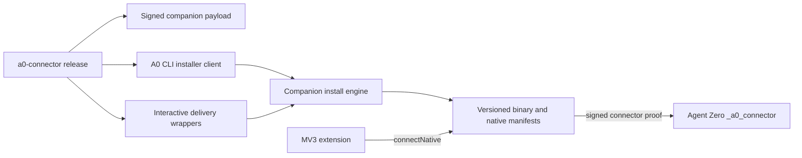

# Agent Zero Browser Bridge Host Companion and Install v1

Status: **Frozen architecture decision**  
Install contract: `a0.browser-bridge.install.v1`  
Canonical map: https://github.com/TerminallyLazy/agent-zero/issues/13  
Decision ticket: https://github.com/TerminallyLazy/agent-zero/issues/16  
Depends on: #12, #14, and #15

## 1. Scope

This document defines the host companion's implementation and process boundary,
the supported desktop/browser matrix, artifact and release chain, native-host
registration, and install/update/repair/uninstall behavior for both Docker/WebUI
and A0 CLI users.

It covers:

- one companion implementation and its repository ownership;
- on-demand native-host process lifetime;
- per-user files, browser manifests, non-secret state, credentials, and logs;
- stable and development extension identities;
- signed/checksummed release artifacts and compatibility metadata;
- WebUI-first and A0 CLI-first setup;
- deterministic status, repair, upgrade, rollback, and uninstall;
- partial-failure recovery and clean-machine release acceptance.

It does not define final installer artwork/copy, WebUI or side-panel composition,
the browser-operation adapter, enterprise policy deployment, or extension-store
publication metadata.

The terms MUST, MUST NOT, SHOULD, SHOULD NOT, and MAY are normative.

## 2. Verdict

1. The production companion is one memory-safe standalone Rust binary named
   `a0-browser-bridge`. It does not require Python, Node.js, A0 CLI, or Agent Zero
   source on the browser host.
2. Source and release automation live with `agent0ai/a0-connector`. Agent Zero
   Core owns server endpoints and compatibility policy; the extension owns its
   MV3 bundle. No copy of the companion is embedded in the Docker image.
3. Chrome starts one companion process for each `runtime.connectNative()` port.
   The process owns the corresponding Agent Zero connector session and exits
   when that native port closes. V1 installs no login item, launch agent,
   Windows service, scheduled task, or systemd user service.
4. Installation is per OS user and requires no administrator elevation. Native
   manifests point directly to an immutable, versioned binary. There is no
   mutable `latest` symlink, junction, or launcher in the execution path.
5. One transactional install engine inside the companion implements registration
   and health checks. A0 CLI invokes that engine; WebUI users receive OS-specific
   delivery wrappers around the same signed payload.
6. V1 supports stable desktop builds of Chrome, Edge, Brave, Vivaldi, Opera, and
   Chromium where the browser exposes Chromium native messaging. Sandboxed
   Snap/Flatpak browser packages are unsupported unless a tested host-integration
   mechanism is added.
7. Release assets are immutable and content-addressed. Every artifact is covered
   by a signed release catalog, SHA-256 digest, verifiable build provenance
   (approved local signed provenance or GitHub attestation), and platform
   signature where available.
8. The native host does not self-update. `a0 browser-extension update` and the
   downloaded interactive installer are its explicit update paths. A native
   session may report availability but never downloads or executes release
   content. A store-distributed extension follows the browser's signed automatic
   update lifecycle; it does not implement a separate downloader. The MV3
   runtime drains work and reloads only at a safe boundary as frozen in #18.
9. Repair is non-destructive to pairing keys and refuses to overwrite an
   unrecognized registration. Uninstall revokes when possible, removes only
   owned registrations/files, and reports any unreachable server-side record.
10. Docker/WebUI and A0 CLI installations result in the same companion binary,
    state schema, browser manifests, key backend, and server bridge record.

## 3. Ownership and component boundary



### 3.1 `agent0ai/a0-connector`

The repository owns:

- a Rust workspace for the companion, install engine, protocol model, and
  platform adapters;
- the Python A0 CLI `browser-extension` command group;
- signed release catalogs, payload archives, installer wrappers, checksums,
  SBOMs, notices, and build attestations;
- registration tables and clean-machine installer tests.

Recommended source boundary:

```text
native/browser-bridge/
  Cargo.toml
  src/
    main.rs
    native_host/
    install/
    credentials/
    connector/
    diagnostics/
  browser-registry-v1.json
  release-catalog.schema.json
src/agent_zero_cli/browser_extension.py
```

The exact module split may change, but the Rust binary and Python orchestration
remain separate. The CLI MUST NOT import or duplicate companion internals.

### 3.2 Agent Zero Core

The bundled `_a0_connector` plugin owns:

- pairing and connector-challenge endpoints from trust v1;
- compatible companion/extension version ranges and security floors;
- bridge records, policy, revocation, and bounded audit;
- a host-platform-neutral installer catalog link and WebUI status projection.

Plugin install/update hooks MUST NOT write browser-host files, run a host
installer, or imply that a Docker filesystem is the desktop host.

### 3.3 Chrome extension

The extension owns `connectNative`, the extension/profile instance identifier,
browser capabilities, restart logic, and visible local setup state. It does not
own the companion binary, release catalog, private key, or server credential.

## 4. Companion implementation contract

### 4.1 Runtime

The companion is built with a pinned stable Rust toolchain and committed
`Cargo.lock`. It uses:

- an asynchronous runtime for native framing, TLS, Socket.IO/WebSocket, and
  bounded artifact streaming;
- a pure-Rust TLS stack where practical so Linux does not inherit an untracked
  system OpenSSL dependency;
- operating-system credential APIs behind explicit adapters;
- bounded schemas generated or tested against protocol v1 and trust v1 fixtures.

Release builds forbid runtime code download, dynamic plugin loading, shell
evaluation, and extension-supplied executable paths. The production binary has
no general file, shell, or Computer Use command surface.

Rust is selected because Docker/WebUI users need a self-contained host payload,
while a Python or Node companion would either require a second managed runtime
or a larger frozen application with more dynamic dependency and signing surface.
A0 CLI remains Python and only orchestrates the standalone artifact.

### 4.2 Execution modes

One binary exposes distinct modes:

| Mode | Invoker | Output contract |
|---|---|---|
| Native host | Chromium browser supplies caller-origin argv | Native length-prefixed JSON on stdout; diagnostics never use stdout. |
| `install` | Installer wrapper or A0 CLI | Human output or versioned JSON with `--json`. |
| `status` / `doctor` | User, installer, or A0 CLI | Read-only human output or versioned redacted JSON. |
| `repair` / `update` / `uninstall` | Installer wrapper or A0 CLI | Transaction result; explicit mutation. |
| `pair --stdin` | A0 CLI | Reads one ephemeral pairing bundle from stdin; never argv/environment. |
| `self-test` | Installer/CI | Offline binary/framing/platform checks; no credential or network access. |

Native-host mode is selected only when argv contains an exact registered
`chrome-extension://<id>/` caller origin in the position defined by Chromium.
Windows' optional `--parent-window` argument is parsed but never treated as
identity. Invalid invocation fails before reading a protocol frame.

### 4.3 Process lifecycle

The service worker uses one long-lived `runtime.connectNative()` port. Chromium
starts the host and keeps it running until that port is destroyed. The native
port also keeps an MV3 worker active on supported Chromium versions, while an
`onDisconnect` path and alarms still provide crash/restart recovery.

For each native port, the companion:

1. validates the actual caller origin;
2. reads and validates `bridge.hello` within 10 seconds;
3. selects or creates local profile binding state;
4. proves the paired identity and opens one scoped Agent Zero connector session;
5. relays only negotiated protocol-v1 messages;
6. cancels or terminalizes in-flight work truthfully when either boundary closes;
7. removes private artifact spools and exits within 5 seconds when quiescent.

There is no permanent broker process. Concurrent browser profiles may have
concurrent host processes and distinct bridge identities. File locks protect
install state and per-bridge spool paths without merging connector authority.

## 5. Supported matrix

### 5.1 Operating systems and architectures

The stable v1 policy is:

| Platform | Architectures | Support window |
|---|---|---|
| macOS | universal binary containing `arm64` and `x86_64` | Current generally available macOS and previous two major releases. |
| Windows | native `x86_64` and `arm64` payloads | Microsoft-supported Windows 11 releases. |
| Linux desktop | static/minimally dynamic `x86_64` and `aarch64` payloads | Current two Ubuntu LTS releases and current/previous Fedora; other conventional distributions best effort. |

The signed release catalog records exact minimum OS/kernel/library requirements
for each artifact. Unsupported architecture or OS is reported before download or
mutation. Rosetta or Windows x64 emulation is not a substitute for a missing
native acceptance artifact.

### 5.2 Browsers

Stable v1 registration targets are:

- Google Chrome Stable;
- Microsoft Edge Stable;
- Brave Stable;
- Vivaldi Stable;
- Opera Stable;
- Chromium stable/vendor package.

The extension runtime still performs capability negotiation. Registration does
not promise that every browser exposes side panel, debugger, or tab-group APIs
identically. The browser-runtime frontier owns those feature degradations.

Chrome for Testing and browser Beta/Dev/Canary channels are development-only.
They require an explicit `--include-prerelease-browsers` or development channel;
the stable installer does not discover/register them silently.

Linux Snap/Flatpak browser builds are unsupported in v1 because native-messaging
sandbox access and manifest injection differ by package. `status` identifies a
sandboxed browser and gives a native-package remediation instead of writing into
its sandbox. In particular, Vivaldi documents that Native Messaging is
unavailable in its Snap build.

### 5.3 Browser version floor

The extension declares a Chromium-major minimum chosen by its runtime contract;
v1 cannot be lower than Chromium 120 because it relies on the current MV3 alarm
and recovery behavior. Release acceptance covers the current stable Chromium
major and previous two majors, never an unbounded historical range.

## 6. Per-user installation layout

Default roots are:

| Platform | Root |
|---|---|
| macOS | `~/Library/Application Support/Agent Zero/Browser Bridge/` |
| Windows | `%LOCALAPPDATA%\Agent Zero\Browser Bridge\` |
| Linux | `${XDG_DATA_HOME:-~/.local/share}/agent-zero/browser-bridge/` |

The logical layout is:

```text
releases/<companion-version>/<platform-arch>/a0-browser-bridge[.exe]
releases/<companion-version>/<platform-arch>/release-catalog.json
releases/<companion-version>/<platform-arch>/release-catalog.sig
releases/<companion-version>/<platform-arch>/build-provenance.json
releases/<companion-version>/<platform-arch>/build-provenance.sig
manifests/<browser>/io.agentzero.browser_bridge.json
install-state.json
transactions/<transaction-id>.json
spool/<bridge-id>/<artifact-id>
logs/
```

Rules:

- each release directory is immutable after activation;
- a native manifest points directly to its active versioned binary;
- `install-state.json` is non-secret, schema-versioned, mode `0600` where Unix
  modes exist, and replaced atomically;
- directory permissions are user-only where supported;
- transaction journals contain paths/digests only and are removed after commit
  or successful rollback;
- spools are per bridge, bounded by protocol v1, and removed on acknowledgement,
  expiry, repair cleanup, or uninstall;
- private keys are never stored in this tree except the explicitly acknowledged
  Linux file-protected fallback from trust v1.

`install-state.json` records at least:

```json
{
  "schema_version": 1,
  "install_id": "opaque-random-id",
  "channel": "stable",
  "active_version": "2.12.0",
  "active_artifact_sha256": "hex-digest",
  "previous_version": "2.11.0",
  "installed_at_ms": 1788492400000,
  "source": "a0_cli",
  "registered_browsers": ["chrome", "edge"],
  "release_catalog_key_id": "release-root-2026"
}
```

It contains no pairing code, private key, session cookie, API key, server bearer
credential, page content, or full server URL with query/fragment/userinfo.

## 7. Native-host registration

### 7.1 Manifest

Production uses this logical manifest:

```json
{
  "name": "io.agentzero.browser_bridge",
  "description": "Agent Zero browser bridge",
  "path": "/absolute/versioned/path/a0-browser-bridge",
  "type": "stdio",
  "allowed_origins": [
    "chrome-extension://published-chrome-web-store-id/",
    "chrome-extension://published-edge-addons-id/"
  ]
}
```

Only actual published IDs are included. If the same store ID is used across
multiple browsers it appears once. The signed release catalog supplies the
allowed production IDs, and the companion verifies they match its compiled
allowlist before installation. Remote Agent Zero data cannot add an origin.

Development uses a different host name, root, state file, manifests, and keys:

```text
io.agentzero.browser_bridge.dev
```

An arbitrary development extension ID requires a local interactive command with
`--channel development --extension-id <exact-id>`. Stable install/repair never
copies a development ID into the production manifest.

### 7.2 Registration locations

`browser-registry-v1.json` is a versioned, reviewed source file compiled into the
installer. It defines only canonical native-messaging locations, never arbitrary
profile paths supplied by the extension or server.

Required examples include:

| Platform/browser | Per-user registration |
|---|---|
| Windows Chrome | `HKCU\Software\Google\Chrome\NativeMessagingHosts\io.agentzero.browser_bridge` |
| Windows Edge | `HKCU\Software\Microsoft\Edge\NativeMessagingHosts\io.agentzero.browser_bridge` |
| Windows Chromium | `HKCU\Software\Chromium\NativeMessagingHosts\io.agentzero.browser_bridge` |
| Windows Brave, Vivaldi, Opera | Chrome compatibility key above; one owned registration is reference-counted across the selected families. |
| macOS Chrome | `~/Library/Application Support/Google/Chrome/NativeMessagingHosts/` |
| macOS Edge | `~/Library/Application Support/Microsoft Edge/NativeMessagingHosts/` |
| macOS Brave | `~/Library/Application Support/BraveSoftware/Brave-Browser/NativeMessagingHosts/` |
| macOS Vivaldi | `~/Library/Application Support/Vivaldi/NativeMessagingHosts/` |
| macOS Opera | `~/Library/Application Support/com.operasoftware.Opera/NativeMessagingHosts/` |
| macOS Chromium | `~/Library/Application Support/Chromium/NativeMessagingHosts/` |
| Linux Chrome | `${XDG_CONFIG_HOME:-~/.config}/google-chrome/NativeMessagingHosts/` |
| Linux Edge | `${XDG_CONFIG_HOME:-~/.config}/microsoft-edge/NativeMessagingHosts/` |
| Linux Brave | `${XDG_CONFIG_HOME:-~/.config}/BraveSoftware/Brave-Browser/NativeMessagingHosts/` |
| Linux Vivaldi | `${XDG_CONFIG_HOME:-~/.config}/vivaldi/NativeMessagingHosts/` |
| Linux Opera | `${XDG_CONFIG_HOME:-~/.config}/opera/NativeMessagingHosts/` plus the Chrome compatibility location required by Opera's native-messaging contract. |
| Linux Chromium | `${XDG_CONFIG_HOME:-~/.config}/chromium/NativeMessagingHosts/` |

Windows Brave, Vivaldi, and Opera use the documented/established Chrome
compatibility registration in v1 rather than speculative vendor keys. Because
that value is shared, install state tracks the selected-family references and
uninstall removes it only when no owned target still needs it. On macOS/Linux,
when a browser checks both its vendor directory and a Chrome compatibility
directory, both owned copies are generated from identical bytes and verified.

The installer creates only the `NativeMessagingHosts` directory and owned
manifest/registry value. It never opens or edits a browser profile database,
preferences file, history, cookies, extension state, or policy store.

### 7.3 Ownership and collision rule

Before writing, the installer resolves any existing registration:

- if it points to this `install_id` and an owned manifest, update/repair may
  replace it transactionally;
- if it is byte-identical but from an older owned release, it is migratable;
- if ownership cannot be proven, installation fails with
  `REGISTRATION_CONFLICT` and reports the exact registration location without
  overwriting or deleting it.

Uninstall removes a registration only when the registry value/manifest and
target digest still match owned state. Modified or foreign entries are left in
place and reported.

## 8. Browser-profile and pairing binding

Each extension profile creates a random `extension.instance_id` in
`chrome.storage.local`; it is non-secret identity, not authority. The companion
maintains a non-secret mapping from exact extension ID plus instance ID to one
or more server `bridge_id` records. Every bridge private key remains in the OS
credential backend keyed by server instance and bridge ID.

Consequences:

- multiple browser profiles can pair independently through one installed binary;
- concurrent profiles use distinct bridge credentials and connector sessions;
- a second profile never inherits the first profile's bridge merely because the
  extension ID matches;
- reinstalling the extension creates a new instance ID and requires explicit
  re-binding/pairing; it never guesses an old identity;
- companion reinstall preserves pairings only when the OS credential store and
  owned binding records remain intact;
- development and production profiles never share bridge keys.

For CLI-first setup, `pair --stdin` may create a local pending binding containing
the one-time server pairing bundle and expected production extension ID. The
first exact matching extension instance claims it before the server's five-minute
pairing expiry. The pending bundle is memory-only when the extension is already
connected; otherwise it is stored in an owner-only temporary file and deleted
on claim, timeout, restart, or cancellation.

## 9. Release and supply-chain contract

### 9.1 Release train

Companion artifacts ship on the `agent0ai/a0-connector` release train. The
companion version equals the containing release's normalized semantic version,
while protocol and trust compatibility remain independently negotiated integers.
Updating A0 CLI is not required merely to run an already installed compatible
companion.

The current A0 connector release mechanism installs Python from a tagged source
archive and publishes no companion assets. Before host-bridge release, it must
gain a cross-platform artifact workflow and immutable release assets; the source
archive alone is not an installable companion.

### 9.2 Signed catalog

Every release publishes a JCS-canonicalized catalog and detached Ed25519
signature, for example:

```json
{
  "schema_version": 1,
  "release": "2.12.0",
  "channel": "stable",
  "published_at": "2026-09-04T00:00:00Z",
  "protocol": { "min": 1, "max": 1 },
  "trust": { "min": 1, "max": 1 },
  "minimum_secure_companion": "2.12.0",
  "extension_origins": [
    "chrome-extension://published-chrome-web-store-id/",
    "chrome-extension://published-edge-addons-id/"
  ],
  "artifacts": [
    {
      "name": "a0-browser-bridge-macos-universal.tar.gz",
      "platform": "macos",
      "arch": "universal2",
      "sha256": "hex-digest",
      "size": 1234567,
      "kind": "payload"
    }
  ],
  "release_key_id": "release-root-2026"
}
```

The release signing private key is stored outside the repository in protected
release infrastructure. Its public root is pinned in A0 CLI, Agent Zero Core's
installer metadata, and the interactive installer. Catalog key rotation requires
a preceding release that trusts both old and new key IDs; a key delivered only
inside the catalog cannot authorize itself.

Native trust must not contain its own final executable hash or the hash of a
catalog containing that executable's archive: either introduces a cryptographic
self-reference and cannot be produced by an ordinary release build. Compile
publisher/builder public roots, exact platform identities, security floors and
immutable version-specific catalog/provenance URLs before building. Build and
platform-sign the executable, form its archive, sign the catalog, then sign the
detached local derivation statement binding catalog, archive and executable
digests/size. A separately distributed CLI/bootstrap can additionally pin the
final companion/catalog hashes because it is not the artifact being pinned.
No unsigned latest URL, runtime key injection or self-reported digest is allowed.

Install retains the exact verified catalog/signature and signed local derivation
statement/signature in the private immutable release directory, publishing all
four sidecars with the executable before manifest activation. Read-only native
status independently verifies both signatures against compiled roots, the
release/floor/target/origins, the catalog payload archive binding, and the actual
retained executable digest/size against the signed derivation statement. Missing,
changed or unsigned evidence fails closed; install-state hashes are consistency
checks, never release authority. This is an implementation correction to avoid
self-pinning, not a relaxation of signature, provenance or platform requirements.

Install clients verify, in order:

1. supported catalog schema/channel and pinned signing key;
2. detached signature over canonical catalog bytes;
3. artifact name, platform, architecture, byte size, and SHA-256;
4. platform code signature when applicable;
5. offline `self-test` and embedded version/contract agreement.

Any failure deletes the staged artifact and leaves the active installation and
manifests unchanged.

### 9.3 Platform signatures and provenance

- macOS binaries and installer app are Developer ID signed with hardened runtime,
  secure timestamps, notarized, and distributed in a notarized/stapled DMG.
- Windows binaries and installer executable are Authenticode signed and RFC 3161
  timestamped with SHA-256.
- Linux payloads are covered by the signed catalog and digest. The bootstrap
  displays/verifies the catalog key fingerprint and aborts if verification tools
  are unavailable; it never silently falls back to an unchecked binary.
- Every payload, delivery wrapper, catalog, SBOM, and checksums file receives
  verifiable build provenance tied to approved source and builder identity.
  GitHub artifact attestation is supported but is not a required build service;
  the approved local signed release path below is an independent alternative.
- The release includes SPDX or CycloneDX SBOM, dependency license notices, source
  commit, Rust toolchain, and reproducibility metadata.

GitHub attestation is optional additive provenance, not the only install trust anchor.
Platform signatures and the pinned catalog remain mandatory because ordinary
users may not have GitHub CLI available.

Release jobs upload assets only after tests and signatures pass, then make the
release immutable. Tags and published assets are never replaced in place.

#### 9.3.1 Local signed provenance (2026-09-05 clarification)

GitHub Actions availability and OAuth workflow-upload permission are not release
prerequisites. A local builder may produce the same immutable artifacts, but an
unsigned build log, source fingerprint, checksum list or local wheel is not
production provenance. The companion-payload statement is bounded ASCII/JCS JSON
with a detached 64-byte Ed25519 signature and exactly these fields:

`contract: a0.browser-bridge.local-build-provenance.v1`, `schema_version: 1`,
`release`, `platform`, `artifact_arch`, `catalog_key_id`, `catalog_sha256`,
`archive_sha256`, `executable_sha256`, `executable_size`,
`source_repository`, `source_commit`, `source_tree_sha256`, `rust_toolchain`,
`recipe_sha256`, `builder_id`, and `signing_key_id`.

The detached signer is an independently provisioned compiled builder root with
an exact approved builder ID, source repository, recipe digest and toolchain.
Catalog roots do not automatically authorize builders, and statements cannot
introduce keys. Match every catalog/archive/executable digest and target to the
retained candidate; source-tree hashing records dirty local inputs rather than
mislabeling them a clean commit. Other release artifacts require corresponding
signed subject bindings in the release provenance set. This clarification
does not remove catalog signatures, platform signing/notarization, secure
floors, complete artifact coverage, or immutable publication requirements.

#### 9.3.2 Darwin staged-path verification exception

Apple's public `SecStaticCodeCreateWithPath[AndAttributes]` and `execve` APIs
are path-based; macOS has no public `fexecve`, and its `/dev/fd` devices are
not Linux procfs executable links. For this platform only, verification and
bounded metadata/self-test execution may use the one generated private staging
pathname while retaining the original read-only executable descriptor. Hold an
exclusive create-only verification lease, validate the current-user private
parent chain and no symlinks/hardlinks, and recheck inode, mode, byte size and
SHA-256 immediately before and after every system-tool or executable invocation.
Use fixed argument arrays, cleared credential/proxy/loader environment, bounded
output and deadlines, and no alternate pathname fallback. The stable install
transaction acquires its separate installation lock only after all candidate
gates pass; staging verification never creates or modifies installed state.

Require the compiled Developer ID Application team/identifier, all-architecture
signature validation, hardened runtime and secure timestamp on both slices,
and a positive notarized Developer ID assessment. Parse the bounded
`__TEXT,__a0_release` metadata section from both Intel/Apple Silicon Mach-O
slices before comparing executable metadata and running the network-free
self-test. Catalog and local-provenance verification remain mandatory.
This is a per-user host trust boundary, not containment of an actively
compromised process already running as that same OS user.

### 9.4 Artifact set

Each stable release contains:

- payload archives for every supported OS/architecture;
- a signed/notarized macOS DMG containing a minimal installer app;
- a signed Windows per-user setup executable for each architecture;
- a Linux bootstrap plus payload archives;
- signed catalog/signature, SHA-256 list, SBOM, notices, and attestations;
- protocol/trust conformance fixture version identifiers.

Payload archives contain the same `a0-browser-bridge` binary used by their
delivery wrapper. Installer wrappers contain no separate bridge implementation.

## 10. Install transaction

All entry points invoke the same install engine with this transaction:

1. acquire a per-user install lock with bounded wait;
2. detect OS, architecture, stable browser installations, and sandboxed builds;
3. load current owned state and inspect every candidate registration;
4. verify catalog, artifact, platform signature, and offline self-test;
5. stage a new immutable version directory without changing active manifests;
6. generate exact native manifests from compiled registration data and signed
   production extension IDs;
7. write manifests/registry values one at a time while recording rollback data;
8. read each registration back and verify its manifest, executable path,
   executable bit/signature, IDs, and digest;
9. atomically commit `install-state.json` only after all requested browsers pass;
10. retain at most one previous signed compatible version, remove the journal,
    and report each readiness layer.

If any requested target fails, the engine restores prior owned registry values
and manifests, deletes the staged version, and preserves the old active state.
`--allow-partial` exists only as a development/test flag; production UI and CLI
stable installs are all-or-nothing for their selected browsers.

Install is idempotent. Re-running the same version with the same browser set
performs verification and converges permissions/content without rotating keys,
creating another pairing, or restarting a healthy native process.

The installer never:

- installs or force-enables the browser extension through unmanaged policy;
- closes a browser or edits its profile databases;
- accepts a binary URL, native-host path, or extension ID from Agent Zero/page
  content;
- writes to Docker volumes or requires access to the Agent Zero checkout;
- reports healthy until registration readback and executable verification pass.

## 11. Delivery entry points

### 11.1 Docker/WebUI-first

The Browser settings page is an orchestration surface, not an installer process:

1. It reads compatible release metadata from `_a0_connector` and detects the
   browsing device's likely OS/architecture only to select presentation.
2. It offers every supported artifact explicitly so user-agent detection can be
   corrected.
3. macOS downloads the signed/notarized DMG; Windows downloads the signed setup
   executable; Linux shows a copyable host-terminal command whose bootstrap and
   payload digests are pinned by the current Agent Zero build.
4. The host installer performs per-user install and opens the appropriate
   extension store page only after local verification succeeds.
5. The extension verifies `connectNative` locally and shows **Companion ready**.
6. Only then does the WebUI create the five-minute pairing code. Installation
   time must not consume pairing-code lifetime.
7. After the extension/companion exchanges the code, WebUI verifies server,
   companion, extension, browser capability, and site policy as separate layers.

The binary downloads to the user's browser machine. The Docker container never
downloads an executable for itself, mounts host browser directories, invokes a
host package manager, or claims to detect a local native host directly.

The settings page provides **Download again**, **Show manual steps**, **Pair**,
and **Troubleshoot** actions. It does not use a custom URL scheme or place a
pairing code/server credential in the installer URL.

### 11.2 A0 CLI-first

The CLI adds this stable command family:

```text
a0 browser-extension install [--host URL] [--browser NAME ...] [--json]
a0 browser-extension status [--host URL] [--json]
a0 browser-extension pair [--host URL] [--json]
a0 browser-extension repair [--browser NAME ...] [--json]
a0 browser-extension update [--json]
a0 browser-extension uninstall [--yes] [--force-local] [--keep-logs] [--json]
```

Global host resolution reuses the current A0 CLI host picker/config/session
rules. Browser values are `auto`, `chrome`, `edge`, `brave`, `vivaldi`, `opera`,
and `chromium`; repeated explicit values form the complete target set. `auto`
selects installed supported stable browsers and never prerelease/sandboxed builds.

Command responsibilities:

| Command | Contract |
|---|---|
| `install` | Resolve the latest compatible signed catalog, install/verify selected browsers, offer/open store pages, then offer pairing when authenticated. |
| `status` | Read-only local layered diagnostics; with an authenticated host, add server bridge/compatibility status. |
| `pair` | Create one trust-v1 intent through the authenticated/CSRF session and hand it to Chrome Options once; a future profile-bound companion rendezvous may replace this explicit handoff. |
| `repair` | Restore owned binary permissions/manifests/state from a verified artifact without deleting/rotating keys or revoking bridges. |
| `update` | Stage and activate the newest compatible signed stable version explicitly. |
| `uninstall` | Revoke when reachable, remove owned registrations/credentials/files, and report stale remote state or pending deletion. |

If `install` cannot authenticate to the chosen Agent Zero instance, local install
still succeeds and prints/opens the WebUI or extension pairing path. It never
asks for an Agent Zero password on a child-process command line.

The current CLI bootstrap selects the newest compatible release from its
independently packaged immutable archive/executable pins, never an unsigned
latest response. It downloads with bounded TLS and no redirects or ambient
proxy, checks the archive and final executable, retains private staging through
native invocation and delegates all installation mutations to that executable.
Missing approved pins fail before network access; local development is separate.

CLI pairing deliberately preserves Chrome profile/install authority: on explicit
human `pair` in a terminal, obtain one five-minute trust-v1 intent and display its
code once with the exact approved extension Options address and Agent Zero base
URL. The user pastes it into Options; the extension-owned native session performs
the exchange and remembers pairing. This narrowly permitted interactive secret
reveal is not generic diagnostic output. Never put codes in files, URLs, child
arguments/environment, JSON or redirected output. JSON/non-terminal pairing
creates no intent and returns action-required with the WebUI/terminal route.
Do not retry an ambiguous creation POST, auto-create codes during install, or
report paired before Chrome confirms. A native CLI without a profile-bound
rendezvous must not impersonate the extension by inventing install identity.

`--json` emits one schema-versioned result object to stdout and human progress to
stderr. It never emits secrets, pairing codes, cookies, raw manifest bodies, or
private paths beyond the explicitly requested diagnostic detail class. Native
host mode and CLI JSON mode are separate parsers so ordinary CLI output can
never corrupt native framing.

Exit codes are stable:

| Code | Meaning |
|---|---|
| `0` | Requested state achieved/healthy. |
| `2` | Usage or unsupported platform/browser. |
| `3` | Not installed or required extension/browser absent. |
| `4` | Authentication/pairing/permission required. |
| `5` | Integrity, signature, collision, or policy failure. |
| `6` | Partial/pending cleanup requiring user action or restart. |
| `7` | Network/release/server unavailable; prior install unchanged. |

The existing `a0 update` command updates the Python CLI only. Afterward it may
report that an installed companion update exists, but it does not silently
mutate it. The explicit bridge update command owns that lifecycle.

## 12. Update, activation, and rollback

### 12.1 Update policy

Native sessions never contact GitHub or an update service. Update discovery is:

- requested explicitly by CLI/installer; or
- server/extension metadata comparing non-secret versions and presenting an
  availability notice no more than once per day.

Only stable-to-stable upgrades occur by default. A development channel uses its
separate host name/root/key set. Downgrade requires an explicit local developer
flag and is refused below the greatest signed `minimum_secure_companion` known
locally or supplied by the paired server.

### 12.2 Activation

Running native processes continue from their already opened versioned binary.
An update never kills them or swaps bytes underneath them. After staging and
self-test, registration manifests are atomically rewritten to the new version;
future native connections launch it. Existing operations may finish under their
negotiated compatible version.

The previous version remains for at most seven days or until one successful
native hello plus server connection is observed from the new version. Retention
is one previous release only and never includes a revoked security floor.

### 12.3 Rollback

There is no silent automatic downgrade. `repair --rollback` is an explicit user
action that:

- verifies the retained previous artifact/signature again;
- checks it against server and signed security floors;
- transactionally repoints owned manifests;
- preserves keys and pairing records;
- records the reason and exact version transition in redacted diagnostics.

If the new version fails before successful native hello, `status` recommends the
eligible rollback. If no safe retained version exists, repair reinstalls the
latest compatible release.

## 13. Status and repair

### 13.1 Layered status

Status never collapses a partially broken installation into **Installed**. It
reports:

| Layer | Examples |
|---|---|
| Artifact | version, digest/signature valid, executable, supported architecture |
| Install state | schema readable, active version, interrupted transaction |
| Browser | detected package/channel/sandbox, registration path/value |
| Manifest | parseable, exact host name/path/origins, target exists and matches digest |
| Credential | backend available, bridge key references present; never key bytes |
| Extension | last exact extension/profile hello, version, local permission readiness |
| Server | bridge active/revoked, last auth, compatibility, reachable/TLS state |
| Runtime | last clean exit/crash code, native framing/connectivity health |

Local-only status labels remote facts as **not checked**, not failed or healthy.
Server status requires the A0 CLI's authenticated session or a live proven bridge.

### 13.2 Repair

Repair:

1. acquires the install lock and recovers/rolls back an interrupted transaction;
2. verifies the current artifact and platform signature;
3. re-downloads only from the signed catalog when bytes are missing/corrupt;
4. restores owner-only permissions and owned manifests/registry values;
5. removes expired spools and stale transaction files;
6. retains all valid bridge keys and profile bindings;
7. reads back each layer and returns remaining remediation.

Repair does not revoke, re-pair, broaden browser targets, install an extension,
or overwrite a registration collision. `repair --reset-pairing` is intentionally
absent; disconnect/revoke plus pair are separate explicit actions.

## 14. Credential adapters and local identity

Credential backend order remains trust-v1 compatible:

| Platform | Backend |
|---|---|
| macOS | Keychain Services generic-password/key item scoped to the current user and signed companion identity. |
| Windows | Credential Manager (`CredWrite`/`CredRead`) in the current logon session. |
| Linux | Freedesktop Secret Service in the current desktop login session. |

The companion stores one key item per `server_instance_id`/`bridge_id` and a
separate random `companion_instance_id`. Non-secret extension-profile bindings
reference bridge IDs but cannot retrieve keys.

Linux without an available/unlocked Secret Service reports
`CREDENTIAL_BACKEND_UNAVAILABLE`. The user may interactively approve the trust-v1
file-protected fallback; non-interactive install/pair requires an explicit flag
whose name states the reduced protection. Files use an owner-only directory and
mode `0600`, never sync/cloud config directories.

Installer update and repair never export, move, or rewrite private keys. A
platform account migration is not accepted as proof that a key was safely moved;
status verifies availability and pairing is repaired explicitly if necessary.

## 15. Uninstall and disconnect

`pairing.disconnect` and host uninstall are distinct:

- **Disconnect** revokes/removes a bridge identity but leaves the companion and
  extension installed.
- **Uninstall** removes the companion for the current OS user and therefore must
  address every locally known bridge.

Interactive uninstall presents the registered browsers, local bridge count,
server reachability, and files to remove. `--yes` authorizes the exact discovered
owned set; it does not authorize foreign registrations.

Uninstall order is:

1. acquire the install lock and snapshot owned registrations;
2. for each reachable server, request authenticated revocation and verify it;
3. for unreachable servers, require interactive acknowledgement or
   `--force-local`, and return their safe server labels/instance fingerprints;
4. delete local private keys and pending pairing/rotation records;
5. remove owned browser registry values/manifests so no future process launches;
6. ask active processes to stop through their existing native/server control and
   wait up to 10 seconds;
7. delete spools, version directories, state, and logs unless `--keep-logs`;
8. read back registration/files and report complete or pending cleanup.

On Windows, a still-running signed executable may be scheduled for deletion at
reboot after its registry entries and credentials are removed. Exit code `6`
reports this as **Uninstalled; file removal pending restart**. Unix deletion of
an open inode is allowed, but the running process is still revoked and asked to
exit.

The browser extension is never silently removed. After companion uninstall it
shows **Companion not installed** and links to reinstall or the browser's normal
extension-management surface.

## 16. Diagnostics, logs, and privacy

### 16.1 Local diagnostics

`doctor --json` is safe to attach to a bug report by default. It includes:

- install/status schema, platform/architecture, companion version, and artifact
  digest prefix;
- detected browser family/channel/version and sandbox classification;
- registration presence, ownership, target existence, and permission checks;
- credential backend availability and key-reference counts only;
- exact extension ID/version and hashed profile instance correlation;
- server origin reduced to scheme/host/port, instance fingerprint, reachability,
  TLS category, compatibility result, and last bounded error code;
- transaction/crash timestamps and redacted state-machine stages.

It excludes private keys, pairing codes, signatures, cookies, API keys, headers,
full URLs, page/tab content, selectors, scripts, browser history, form data,
artifact bytes, home username, and arbitrary environment variables.

### 16.2 Logs

Native stdout is reserved exclusively for length-prefixed protocol frames.
Diagnostics use protected rotating files; stderr receives only bounded startup
failures that Chromium may surface.

Defaults are five files of 2 MiB each and 14-day maximum age. Logs contain event
codes, versions, correlation IDs, duration, byte counts, and outcome certainty,
using the redaction rules from trust v1. Debug logging requires an explicit local
time-limited switch, expires within one hour, and still never records secrets,
page bodies, raw frames, or typed values.

The companion does not upload telemetry or crash dumps in v1. A future opt-in
telemetry decision must define consent, endpoint, retention, and schema before
network transmission.

## 17. Failure and recovery matrix

| Condition | Required result |
|---|---|
| Browser closes | Native stdin/port closes; companion terminalizes/cancels safely, cleans spools, exits. |
| Side panel closes | No lifecycle effect; service worker/native port continue. |
| MV3 worker or host crashes | Port disconnect is recorded; alarms/top-level handlers reconnect and reconcile. |
| Agent Zero/Docker restarts | Companion retries bounded connector recovery with fresh proof; extension/native port remains local. |
| Installer interrupted before activation | Old state remains active; next status/repair rolls back staging journal. |
| Installer interrupted during manifest writes | Journal restores previous owned values before retry. |
| Artifact/signature mismatch | Staged bytes deleted; no manifest or active state change. |
| Existing foreign host registration | Fail `REGISTRATION_CONFLICT`; do not overwrite/remove. |
| Active manifest target missing | Status unhealthy; repair restores the signed active/latest-compatible artifact. |
| Browser installed after companion | Extension reports host missing; repair/register adds the explicitly selected browser. |
| Sandboxed Linux browser | Report unsupported package and native-package remediation. |
| Secret Service locked/unavailable | Pairing blocked until unlock or explicit file-protected fallback approval. |
| Server unreachable during uninstall | Require acknowledgement/`--force-local`; remove local authority and identify stale remote record. |
| New release incompatible with server | Do not activate; keep current compatible version and report versions. |
| New release fails first hello | Keep registrations on new version but recommend explicit safe rollback; never silently downgrade. |
| Extension reinstalled/new profile | New instance is unpaired; never inherit another profile's bridge. |

## 18. Conformance and release gates

The install contract is not complete until automated tests prove:

1. Each release target builds from the committed Rust toolchain/lock and reports
   the catalog version/protocol/trust values.
2. Catalog signature, artifact digest/size, platform signature, and self-test are
   checked before execution or activation.
3. Wrong OS/architecture/channel/key ID, corrupt archive, truncated download,
   and catalog/artifact version mismatch fail without changing active state.
4. Stable installers cannot add arbitrary extension IDs; development registration
   uses the separate host/root/key namespace.
5. Install is idempotent and an interrupted step restores the prior owned state.
6. Every supported browser/OS fixture generates the exact host name, manifest
   path or registry key, absolute executable path, and production origins.
7. A foreign same-name registration is never overwritten or removed.
8. Manifest readback proves its target exists, is executable, signed/digest
   matched, and points to the active immutable version.
9. Chrome/Edge native ports launch the companion on clean supported macOS,
   Windows, and Linux machines.
10. Brave, Vivaldi, Opera, and Chromium registration receive live smoke coverage
    on each OS where the vendor ships a conventional desktop package.
11. Sandboxed Linux packages are detected and not falsely reported healthy.
12. Closing the side panel leaves the native session active; closing the browser
    causes clean host exit without an installed daemon/service.
13. Native host crash and MV3 restart reconnect without duplicate operations or
    loss of protocol-v1 lease reconciliation.
14. Multiple browser profiles use distinct bridge keys/sessions and cannot adopt
    each other's profile binding.
15. WebUI and CLI paths install byte-identical payload digests and equivalent
    registration/state schemas.
16. WebUI pairing code creation occurs after installation, not before a lengthy
    download/install flow.
17. CLI pairing passes the bundle through stdin/rendezvous without argv,
    environment, JSON output, shell history, or logs.
18. `status --json` is stable/read-only and distinguishes not-checked, missing,
    unhealthy, permission-required, and healthy layers.
19. Repair restores owned files/manifests without rotating/deleting keys or
    overwriting collisions.
20. Update lets existing processes finish on old bytes while future launches use
    the new version.
21. Downgrade/rollback below a signed or server security floor is refused.
22. Uninstall revokes reachable bridges, requires acknowledgement for unreachable
    records, removes only owned state, and truthfully reports pending Windows
    deletion.
23. Logs/doctor fixtures prove forbidden credential, URL, page, selector, path,
    form, script, and artifact data is absent.
24. No install path touches browser history/cookies/preferences, Docker host
    mounts, Agent Zero `usr/` state, or an unmanaged policy store.
25. Release tooling emits signed artifacts, immutable release, checksums, SBOM,
    notices, and verifiable approved local or GitHub provenance for the exact
    published bytes; GitHub Actions itself is not a required execution service.
26. The old Agent Zero Docker browser and existing A0 CLI CDP/Playwright browser
    paths remain functional when the companion is absent, broken, or unpaired.

Manual release acceptance uses clean snapshots for:

- current and two previous supported macOS releases on Intel and Apple Silicon;
- supported Windows 11 x64 and arm64;
- current two Ubuntu LTS and current/previous Fedora on applicable architectures;
- each supported browser family, with a bounded pairwise matrix plus required
  Chrome/Edge coverage on every OS/architecture.

## 19. Agent Zero and A0 CLI implementation anchors

- Add companion source/release machinery to `agent0ai/a0-connector`; do not place
  a host executable in Agent Zero's Docker image or bundled plugin directory.
- Add the `browser-extension` argparse command family beside current `update`,
  `headless`, `acp`, and `gateway` commands. Keep headless/gateway imports and
  stdout contracts isolated.
- Reuse A0 CLI's current host discovery, authenticated HTTP session, cookies,
  Origin, and CSRF flow only to create/manage pairing. Never persist the pairing
  code or companion key in CLI config/session files.
- Keep server installer metadata and pairing/status APIs in `_a0_connector`.
  Plugin APIs retain normal auth/CSRF defaults except the one-time exchange and
  proof endpoints frozen in trust v1.
- Agent Zero plugin activation/update/uninstall cannot clean host manifests
  because Docker does not own them. The WebUI instead shows last-known companion
  status and host-side repair/uninstall directions.
- Any future core/helper or direct API changes require the applicable AGENTS/DOX
  and security tests. Companion and CLI repository changes require their own
  source-tree contracts and installer test documentation.
- Do not edit `agent.py` or `initialize.py` for installation. Browser runtime
  integration remains behind `_browser` and `_a0_connector`.

## 20. Deferred decisions

- Final installer visual design, copy, icons, screenshots, and WebUI/side-panel
  component layout.
- Managed enterprise/system-wide deployment, MDM/Group Policy, offline mirror,
  and organization-controlled extension IDs.
- Automatic background updates or a persistent multi-capability host daemon.
- Native support for sandboxed Snap/Flatpak browsers, ChromeOS, Firefox, Safari,
  mobile browsers, and remote browser hosts.
- Store publication/review/privacy declarations and whether Edge Add-ons receives
  a separately packaged extension.
- Opt-in telemetry/crash upload.
- More than one retained rollback version or long-term release channels.

## 21. Research basis

Public platform and release sources:

- [Chrome native messaging](https://developer.chrome.com/docs/extensions/develop/concepts/native-messaging)
- [Chrome extension service-worker lifecycle](https://developer.chrome.com/docs/extensions/develop/concepts/service-workers/lifecycle)
- [Microsoft Edge native messaging](https://learn.microsoft.com/en-us/microsoft-edge/extensions/developer-guide/native-messaging)
- [Apple notarization](https://developer.apple.com/documentation/security/notarizing-macos-software-before-distribution)
- [Apple Keychain Services](https://developer.apple.com/documentation/security/keychain-services)
- [Microsoft Authenticode timestamping](https://learn.microsoft.com/en-us/windows/win32/seccrypto/time-stamping-authenticode-signatures)
- [Windows Credential Manager](https://learn.microsoft.com/en-us/windows/win32/secbp/handling-passwords)
- [Freedesktop Secret Service](https://specifications.freedesktop.org/secret-service/latest-single/)
- [GitHub artifact attestations](https://docs.github.com/en/actions/how-tos/secure-your-work/use-artifact-attestations/use-artifact-attestations)
- [GitHub release integrity](https://docs.github.com/en/code-security/how-tos/secure-your-supply-chain/secure-your-dependencies/verify-release-integrity)
- [Vivaldi Snap native-messaging limitation](https://help.vivaldi.com/desktop/install-update/install-vivaldi-for-snap/)

Agent Zero compatibility was traced through the current `_a0_connector` and
plugin DOX, Agent Zero API/WebSocket security contracts, the installed A0 CLI
`__main__`, session/config/gateway/self-update contracts, and the current
`agent0ai/a0-connector` v2.11 package/release metadata. That release currently
contains no binary assets and is not immutable, so it is evidence of the change
required, not release readiness.

The locally installed first-party ChatGPT native manifests and executable
signature were inspected only to confirm behavior-level precedent: exact
extension origins, per-browser manifest registration, a versioned host path,
Developer ID signing, and an on-demand native executable. No proprietary binary,
source, assets, credentials, or implementation were copied.
