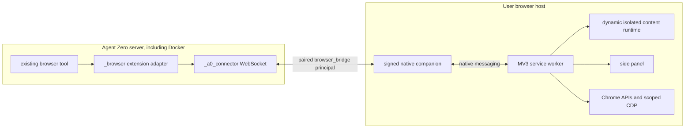

# Agent Zero MV3 Browser Runtime v1

Status: **Frozen architecture decision**  
Contract: `a0.browser-bridge.mv3-runtime.v1`  
Canonical map: https://github.com/TerminallyLazy/agent-zero/issues/13  
Decision ticket: https://github.com/TerminallyLazy/agent-zero/issues/18  
Depends on: `a0.browser-bridge.v1`, `a0.browser-bridge.trust.v1`,
`a0.browser-bridge.install.v1`, and `a0.browser-bridge.adapter.v1`

## 1. Verdict

The extension is an event-driven Manifest V3 runtime, not a side-panel process
and not an HTTP polling client. Its service worker owns one Chrome native
messaging port, validates and routes the full-duplex v1 JSON-RPC contract, and
is the only component allowed to exercise privileged Chrome APIs. Content
scripts are dynamically injected only into approved, leased web tabs. The side
panel is a detachable presentation client.

Browser ownership is exact and generation-bound. Agent-created tabs receive a
lease before success is reported and join the current task group. Claimed user
tabs are never automatically grouped or closed. Finalization closes only an
exactly matching, current-generation, ephemeral, agent-created lease; every
uncertain or user-taken-over tab is retained.

The service worker keeps current working state in `chrome.storage.session`, but
that store is not durable across extension reload, update, disable, or browser
restart. A bounded, redacted `chrome.storage.local` write-ahead ledger is
therefore mandatory for mutation certainty, finalization tombstones, unacked
critical events, and orphan reporting. Neither store contains the Agent Zero
credential, reusable pairing secret, raw API key, screenshots, form values, or
general page content beyond a bounded current-generation read receipt in
session storage.

The first implementation targets Chromium 120 or newer. It uses required
HTTP/HTTPS site access for seamless autonomous work, while Agent Zero's
origin/action policy remains an independent, stricter authorization layer. Raw
CDP/evaluation is a separately advertised advanced capability and is never the
default execution path.

## 2. Deployment boundary



Chrome starts the native companion on the browser host. A Docker container does
not call `connectNative`, install a Chrome manifest, or need access to the
browser-host filesystem. The companion owns the server connection and its
credential; the extension never receives that credential.

The live compatibility baseline checked during this decision was the local
`agent-zero` container at `http://localhost:50080/`, published as host port
50080 to container port 80. Its `/a0` directory is a bind mount from
the host's nested `docker/run/agent-zero` checkout, not the primary checkout
itself. Selected connector/browser files matched the primary checkout by hash,
the WebUI returned HTTP 200, and `_browser/status` reported the existing
Playwright runtime with no host connector. Public discovery advertised only the
legacy `a0-connector.v1` browser substrate, and the prototype
`chrome_extension` plugin endpoints returned 404 because that plugin is not
installed. These observations prove the current baseline and incompatibility,
not the future bridge; acceptance must deploy the intended source deliberately
and read back both file identity and negotiated runtime capabilities.

## 3. Component ownership

| Component | Owns | Must not own |
|---|---|---|
| Service worker | Native port, handshake, durable-state writer, operation router, tab/group leases, Chrome API/CDP attachment, reconciliation | Agent policy authority, server credential, UI lifetime |
| Native companion | Native frame validation, paired server connection, credential, artifact spool | Browser intent, tab ownership inference, approvals |
| Content runtime | Local semantic inspection, document-bound references, cursor/overlay, narrowly scoped page action | Native messaging, Chrome tab IDs, policy, cross-tab state |
| Side panel | Conversation/status/activity/approval presentation and user requests | Native-port lifetime, command polling, cancellation or finalization on close |
| Agent Zero | Intent, site/action policy, approval decisions, context/turn lifecycle, final disposition | Raw Chrome tab identity or heuristic cleanup |

All extension event listeners are registered synchronously at service-worker
module scope. Every listener enters the same `ensureBooted()` hydration barrier
before reading state or performing work. No listener is registered from a
resolved promise, callback, panel connection, or conditional initialization
path. A `runtime.onMessage` handler that responds asynchronously returns the
literal `true`, and exactly one sender-validated router owns each message kind.

## 4. Manifest and permissions

The production manifest MUST declare:

- `manifest_version: 3` and `minimum_chrome_version: "120"`;
- permissions `nativeMessaging`, `storage`, `alarms`, `tabs`, `tabGroups`,
  `scripting`, `sidePanel`, `debugger`, and `contextMenus`;
- host permissions `http://*/*` and `https://*/*`;
- the existing service worker, side panel, extension action, and icons.

The manifest MUST NOT statically inject a content script on every site. The
worker uses `chrome.scripting` after verifying a current lease and site grant,
and injects into the intended tab/document only. `activeTab` is redundant with
the required HTTP/HTTPS host permissions and is removed. File URLs, Chrome
internal pages, Web Store pages, DevTools pages, other extension pages, and
incognito tabs are not supported in v1.

The v1 manifest does not request `history`, `bookmarks`, `downloads`,
`notifications`, `unlimitedStorage`, or clipboard permissions. Clipboard-like
key actions are advertised only when the implementation proves a trusted-input
path; direct system clipboard read/write is not a v1 baseline capability.

Broad host access and `debugger` generate visible Chrome warnings. They are
required here because a browser action can originate from the server while no
extension page has a user gesture, and Chrome does not allow `debugger` as an
optional permission. Manifest access is only platform capability: the separate
Agent Zero origin/action policy may still deny or challenge every operation.

## 5. Lifecycle identities

Three identities have distinct lifetimes:

| Identity | Location | Lifetime |
|---|---|---|
| `install_instance_id` | `storage.local` | Stable across worker/browser/extension updates; removed only at uninstall or explicit data reset |
| `load_generation_id` | `storage.session` | Stable across ordinary worker suspension; regenerated when session state is absent after browser restart, extension reload/update, or disable/re-enable |
| `worker_boot_id` | Worker memory | Diagnostic identity for one service-worker evaluation |

Every `tab_handle`, lease, event sequence, document reference, and operation
projection is bound to `load_generation_id`. A stale generation never regains
authority merely because Chrome reused a numeric tab or group ID.

A page execution envelope also carries Chrome `documentId` when available and a
runtime-managed `document_epoch`. Navigation, frame replacement, or content
runtime loss invalidates all element references from the prior document.

## 6. State tiers

### 6.1 Volatile worker state

Worker globals MAY contain only reconstructable process handles:

- the current native `Port` and JSON-RPC correlation table;
- current-worker `AbortController` objects and promise queues;
- UI/content-script ports;
- a single hydration promise and diagnostic `worker_boot_id`.

Globals are never the authority for leases, receipts, event acknowledgements,
connection backoff, policy challenges, or finalization.

### 6.2 Current-generation session state

`chrome.storage.session` contains the current working projection:

- `load_generation_id`, revision, connection and negotiated capabilities;
- active lease/tab/group mappings and document epochs;
- operation stages and bounded sensitive read-only receipt cache;
- pending approvals, controls, artifact descriptors, and current UI snapshot;
- generation-qualified critical-event queue and acknowledgement cursor.

This state may contain authorized, bounded result material needed for an exact
same-generation replay. It is inaccessible to content scripts and is never
treated as durable across a browser/extension load boundary.

### 6.3 Durable local safety ledger

`chrome.storage.local` is a bounded non-content write-ahead and recovery shadow:

- schema version and `install_instance_id`;
- current/prior generation summaries;
- active/recovery lease descriptors containing provider IDs, ownership fields,
  origin, disposition, state, exact-generation identity digest, and redacted URL
  identity, but no page text, title text, query, or fragment;
- canonical parameter hashes and `prepared`, `effect_started`, and safe terminal
  tombstones for mutating actions;
- idempotent cancel/finalize/challenge control tombstones;
- redacted, unacknowledged critical events and generation-qualified cursors;
- reconnect backoff and pending extension-update state.

On every worker boot the extension calls `setAccessLevel` with
`TRUSTED_CONTEXTS` for both local and session storage before serving messages.
It removes legacy API-key and draft fields during migration.

The ledger has a 4 MiB soft ceiling, at most 256 nonterminal operations, 2,048
terminal mutation/control tombstones, and 1,024 unacknowledged critical events.
Acknowledged terminal records older than seven days may be compacted. Active,
unknown, orphan, or unacknowledged records are never silently evicted. If a
write cannot be made safely because of quota or I/O failure, a new mutation
fails `INVALID_STATE/not_applied` before touching Chrome.

All state changes pass through one revisioned service-worker write queue.
External Chrome events join that queue. The worker reads, validates the expected
revision, applies one transition, persists it, and only then publishes the new
projection. Last-writer-wins writes from independent handlers are forbidden.

## 7. Boot and native connection state machine

```text
BOOT
  -> HYDRATING
  -> RESUME_GENERATION | RESET_GENERATION
  -> CONNECTING
  -> NEGOTIATING
  -> RECONCILING
  -> READY

READY -> DISCONNECTED -> one immediate reconnect
                         -> RETRY_WAIT (alarm-backed exponential delay)
                         -> BLOCKED (identity/version/protocol/security fault)

READY -> UPDATE_PENDING -> DRAINING -> runtime.reload()
```

`RESUME_GENERATION` occurs when a valid session projection exists. If it does
not, `RESET_GENERATION` creates a new generation, converts durable prior active
leases to visible retained orphans, and changes incomplete mutating WAL entries
to `outcome_unknown`. It never queries URL/title/group to reconstruct ownership.

The worker calls `chrome.runtime.connectNative` and sends `bridge.hello`. Hello
must finish within 10 seconds and carries `install_instance_id`,
`load_generation_id`, supported contract range, capabilities, inflight stages,
lease digest, and generation-qualified event cursors. No browser action runs
before negotiation and reconciliation complete.

A healthy native port is the primary lifetime mechanism. Alarms are a recovery
net, not a heartbeat, action deadline, or accurate timer. On disconnect, only
the callback for the current port may clear it. The worker records a bounded
`runtime.lastError`, cancels waiting approvals, classifies inflight stages, and
attempts one immediate reconnect after a previously ready session. Repeated
transport/host failures schedule one named alarm at 30 seconds, 60 seconds, two
minutes, then a jittered five-minute cap. Every worker evaluation verifies that
the required alarm exists because alarm persistence is not assumed.

Version mismatch, caller/extension identity mismatch, malformed or oversized
frames, and impossible handshake state enter `BLOCKED`; they do not spin. A
browser/extension/user event or successful repair/update may retry. No durable
work uses `setInterval`, `setTimeout`, or `onSuspend` flushing.

## 8. Extension update and reload

`runtime.onUpdateAvailable` persists the pending version. A ready runtime enters
`DRAINING` only when it has no running/waiting operations, active/finalizing
leases, unresolved challenges, or in-progress artifacts, and all critical
events are durably journaled. The panel displays update-pending state. At a safe
boundary the worker deliberately closes the native port and calls
`runtime.reload()`.

If work is active, update waits for finalization. A forced reload, update,
disable, or browser exit is a generation reset: prior handles fail closed,
incomplete mutations become unknown, and prior tabs remain open as orphans.
The extension package follows the browser's signed update lifecycle; it never
downloads or executes its own update payload. The native companion remains on
the explicit installer/CLI update path defined by the installer contract.

## 9. Full-duplex JSON-RPC router

The native port carries only allowlisted JSON-RPC 2.0 methods from
`a0.browser-bridge.v1`. Batches are rejected. The router validates the full
envelope and method-specific schema before dispatch, correlates IDs in both
directions, permits re-entrant artifact requests while an operation is pending,
and returns one terminal response per request.

Limits remain:

- 768 KiB maximum encoded JSON frame in either direction;
- 512 KiB maximum non-artifact payload;
- 192 KiB maximum raw artifact chunk before base64;
- 25 MiB maximum completed artifact.

Unknown methods, duplicate live correlation IDs, invalid origin/caller, invalid
UTF-8/JSON, impossible state, or oversize data fail closed. Content scripts and
the side panel cannot call native messaging directly; they use narrow,
sender-checked worker messages.

## 10. Operation journal and idempotency

Mutating work uses this persisted sequence:

```text
received -> validated -> prepared -> effect_started
                         |              |-> waiting_approval -> effect_started
                         |              |-> succeeded
                         |              |-> failed
                         |              |-> canceled
                         |              |-> outcome_unknown
                         |-> failed/not_applied
```

The durable `prepared` record, including canonical parameter hash, is written
before the first Chrome side effect. `effect_started` is persisted immediately
before invoking the side-effecting API. A terminal tombstone is persisted
before returning the response.

- Failure before `prepared`: `not_applied`.
- Durable `prepared` or `effect_started` without terminal proof after a crash:
  `unknown`; never automatically replay a mutation.
- Same `action_id` and same hash with a same-generation cached terminal result:
  replay that result.
- Same mutation ID/hash after generation loss: return the durable safe receipt
  and `applied` outcome when known, or `OUTCOME_UNKNOWN`; never reapply.
- Same read-only ID after its session-only result was lost: the read may execute
  again under the same ID.
- Same ID with a different hash: `IDEMPOTENCY_CONFLICT/not_applied`.

Each lease has a serial operation queue. Operations on different leases may run
concurrently. A cancel is cooperative; a persisted terminal result wins over a
late cancel. Disconnect does not imply successful cancellation. Deadline checks
use wall-clock deadlines at every async boundary, not timer firing counts.

## 11. Opaque tab references and claim

Normal handles use `a0t1.<generation-random>.<lease-random>` with at least 128
random bits in each random component and never expose a raw Chrome tab/window/
group ID, URL, title, context, or disposition. Their session mapping contains
provider tab/window ID, lease, context/session/turn, created-or-claimed origin,
disposition, state, group intent/provider group, document epoch, and exact
identity snapshot.

Released and closed handle tombstones remain bounded through the current load
generation so replay fails deterministically. Reclaiming the same user tab
creates a new lease and a new handle.

The side panel may mint a short-lived, generation-bound `candidate_handle` for
the tab the user explicitly selects or mentions. The candidate captures browser
instance, provider tab/window ID, title, and URL together and expires after five
minutes or any tab/document identity change. It conveys no control authority.

Before agent use, the core dispatches `browser.perform` with internal action
`claim` and that candidate. The extension re-reads all captured identity fields
atomically enough to detect change, rejects incognito/restricted/already-leased
tabs, and creates a claimed lease. It returns a normal `tab_handle`. `claim` is
an internal transport prelude to the existing Browser tool, not a second
agent-facing action.

For the extension backend, `list` returns only targetable tabs already leased to
the requesting context/browser session plus safe unavailable counts. It does not
enumerate personal tabs to the agent and never auto-claims them. Explicitly
attached candidates may be shown in the user's context composer, but remain
non-targetable until `claim` succeeds.

`tabs.onReplaced` is the only Chrome signal that automatically transfers a
current mapping to a new numeric tab ID. `tabs.onRemoved` marks the exact lease
closed. URL, title, opener, index, and group similarity are never sufficient to
transfer ownership.

## 12. Leases, groups, and user intervention

An `open` action is journaled before `tabs.create`, then persists the exact
created lease before reporting success. The new tab joins the task-group intent
for its `browser_session_id`. Because Chrome groups cannot span windows, one
intent maps to one provider group per window. Provider group IDs are
browser-load-local and are never durable authority.

Created tabs are grouped; claimed tabs remain in the user's existing group and
position. Group title is bounded and task-derived, color is the configured
Agent Zero color, and collapse/focus changes do not carry ownership meaning.

Expected extension-initiated moves are correlated with the current WAL action.
If the user moves, pins, ungroups, regroups, shares, or otherwise changes a
leased tab outside that correlated transition, the runtime treats it as user
takeover: it removes the cursor/debugger, releases the lease, retains the tab,
emits a critical event, and never fights the user by moving it back. A shared
tab group
is always user-controlled and cannot retain an active agent-created close
disposition.

Open may encounter a crash after Chrome created the tab but before the exact
lease was persisted. That produces an orphan/outcome-unknown record. The tab is
retained; neither URL/title nor the Agent Zero group is used to find and close
it heuristically.

If lease or group establishment returns a deterministic failure while the same
operation still holds the exact `tabs.create` result, it may close only that new
tab before returning failure. Once a crash or identity ambiguity intervenes,
the conservative orphan/retention rule wins.

Top-level `tabs.onDetached`, `onAttached`, `onMoved`, and relevant `onUpdated`
handlers distinguish a correlated extension mutation from user intervention.
`tabs.onRemoved` marks the exact lease `closed` (and any unproven in-flight
mutation unknown); window closure is taken only from `removeInfo.isWindowClosing`.
Page-created popups are unowned and require explicit claim.

## 13. Finalization

Finalization is an idempotent control. For each exact lease:

Automatic close is allowed only when generation, lease, context,
browser-session, turn, and control identities all match; `origin` is `created`;
disposition is `ephemeral`; the exact provider tab still exists; and there is
no user-intervened, protected, ambiguous, or unresolved-reconciliation marker.
Any failed predicate retains or releases the tab with a typed reason.

| Lease | Final action |
|---|---|
| Current-generation `created` + `ephemeral`, exact identity intact | Remove overlay/debugger, close exact tab, persist `closed` |
| `created` + `deliverable` or `handoff` | Remove overlay/debugger, ungroup if still in the extension-owned group, persist `released`, leave open |
| `claimed` | Remove overlay/debugger, persist `released`, leave open in its existing group |
| Missing/mismatched/taken-over/old-generation/orphan | Persist and report `retained` or typed error; never close |

If a close call was issued but its result was lost, finalization records
`outcome_unknown`; reconciliation may prove `closed` only from exact current
identity and the tab's absence. It may never close a different tab to make the
result look successful. `close_all` applies this table only to leases in the
specified `browser_session_id`.

## 14. Execution backends and capabilities

The worker advertises actual support rather than promising the entire Browser
vocabulary. Baseline capabilities are:

- `tabs_v1`: open/list/state/set-active/navigate/history/reload/close under a
  lease;
- `groups_v1`: task group creation and exact correlated movement;
- `semantic_dom_v1`: bounded inspection and document-bound element refs;
- `trusted_input_v1`: scoped debugger-backed pointer/keyboard/form input;
- `screenshots_v1`: artifact-backed page screenshot;
- `cursor_v1`: visible local cursor/action overlay;
- `artifacts_v1`: bounded upload/download/screenshot frames.

`chrome.tabs`/`tabGroups` handle navigation, focus, lifecycle, and grouping.
`chrome.scripting` injects the isolated semantic/cursor runtime into an approved
lease. `chrome.debugger` attaches lazily for trusted input, background page
capture, file input, and narrowly allowlisted CDP behavior. Attachments are
serialized per tab and detached on finalization, release, idle, navigation when
required, or user takeover.

Opening DevTools or another debugger may detach the extension. On
`debugger.onDetach`, the runtime marks that capability unavailable, removes
cursor state, and returns a truthful typed failure. Detach during a mutation
after `effect_started` is `outcome_unknown`; the extension does not repeatedly
reattach or compete with the user. Enterprise blocked hosts and Chrome
restricted targets return `CDP_ATTACH_FAILED` or `CHROME_RESTRICTED_URL` before
effect whenever possible.

`captureVisibleTab` is only an explicit foreground fallback and is throttled
below Chrome's two-calls-per-second ceiling. Normal background screenshots use
scoped `Page.captureScreenshot` and artifact framing. `evaluate`, arbitrary CDP,
viewport emulation, system clipboard access, and browser-wide operations are
not baseline; if later advertised, each needs its own advanced capability and
server policy grant.

## 15. Semantic content and element references

The content runtime accepts only worker-issued envelopes containing contract,
generation, lease, tab, operation/action, document ID/epoch, deadline, and a
discriminated allowlisted page command. The response echoes those bindings.
The worker validates the Chrome message sender, tab/frame/document, lease, and
current operation before accepting any result.

Inspection walks a bounded subset of visible/interactable DOM and accessibility
semantics, redacts prohibited fields, truncates text and node counts, and yields
between batches. It never returns inline binary data. Page content is treated as
untrusted data, never as extension instructions.

Element references are opaque, random, and document-bound, for example
`doc:<epoch-prefix>:<random>`. They map locally to validated nodes or scoped CDP
identities. They are not CSS paths such as `nth-of-type`. Navigation, document
replacement, DOM detachment, frame mismatch, or a missing runtime invalidates
the reference and returns a typed stale-reference failure; the agent must
inspect again.

## 16. Illuminated cursor and accessible activity

The cursor is a consequence of an approved action, not a remote pixel stream.
It lives in an isolated content runtime inside a scoped shadow root with a fixed
viewport container, `pointer-events: none` on every overlay node, no focusable
elements, no page event interception, and a bounded topmost stacking strategy.
It never changes the target node's styles, value, focus, ARIA, or listeners.

Ref actions resolve the target locally, animate to a safe visible point, show a
short action state, and then execute. Coordinate actions animate to their
bounded coordinates. Motion is driven by `requestAnimationFrame`, coalesced,
and capped at 600 ms. `prefers-reduced-motion: reduce` positions immediately
with a static state and no travel or pulse. Forced-colors mode uses a visible
system-color outline. Navigation, cancel, detach, finalization, release, or
takeover removes the overlay. The overlay root and subtree are `aria-hidden`
and inert.

No animation frame crosses native messaging. At most one best-effort
`cursor.arrived` event is emitted per action. The side panel provides the
accessible equivalent through a concise `aria-live="polite"` activity line and
textual status; the hidden page overlay does not announce into the site's
accessibility tree and does not steal screen-reader focus.

## 17. Reconciliation

After hello, the companion/server supplies expected contexts, active turns,
generation-qualified acknowledgement cursors, and known control IDs. The
extension returns current-generation exact leases, inflight stages, safe
terminal tombstones, pending critical events, and prior-generation orphan
summaries.

Deterministic rules are:

- same generation and exact active lease on both sides: resume;
- terminal tombstone: replay its safe receipt;
- incomplete read: retry under the same `action_id` if still authorized;
- incomplete mutation after `prepared`: `OUTCOME_UNKNOWN` unless an
  action-specific exact inspection proves the terminal outcome;
- server expects missing lease: `LEASE_NOT_FOUND`;
- stale generation handle: `TAB_IDENTITY_MISMATCH`;
- extension-only current lease: quarantine and retain until an exact idempotent
  finalize/control resolves it;
- prior-generation or weak identity: retain as orphan, never heuristic match.

Critical events are stored before send and deleted only after the highest
contiguous acknowledgement for the same `load_generation_id`. Old-generation
redacted events may replay from local storage. A naked sequence number never
acknowledges another generation. No layer invents a replacement `action_id` or
`control_id` during reconnect.

## 18. Side-panel independence

The side panel connects to the worker as a replaceable viewer/subscriber. A cold
panel receives the latest bounded status snapshot, then subscribes to updates.
Closing or reloading it removes only that presentation port and context-event
subscription. It does not close the native port, stop an Agent Zero turn,
cancel an operation, resolve a challenge, release a lease, or finalize a tab.

Panel status distinguishes server, companion, extension, browser capability,
site policy, active task, active lease, update pending, recoverable disconnect,
blocked repair, and orphan state. User controls send explicit, idempotent
requests; disconnect is never interpreted as intent.

## 19. Failure contract

| Condition | Runtime response |
|---|---|
| Worker suspension, session intact | Hydrate same generation and reconcile |
| Browser restart or extension reload/update/disable | New generation; old handles invalid; retain/report orphans |
| Native host absent/crashed | One immediate retry after ready, then alarm backoff; visible disconnected state |
| Version/caller/protocol/security mismatch | `BLOCKED`, no retry loop, no browser action |
| Side panel closes | Presentation unsubscribes; browser work continues |
| User closes tab | Exact lease becomes `closed`; critical event; any unproven inflight mutation is unknown; no substitute tab |
| Chrome replaces tab | Transfer only through `tabs.onReplaced`, preserving generation/lease |
| User moves/regroups/shared-state changes tab | User takeover; release and retain |
| Debugger detached | Capability unavailable; typed not-applied or unknown outcome by WAL stage |
| Content runtime/document disappears | Invalidate refs; reinject only after current lease/policy validation |
| Storage write/quota fails before effect | `STORAGE_WRITE_FAILED/not_applied` |
| Crash after durable mutation boundary | Durable receipt or `OUTCOME_UNKNOWN`; never blind retry |
| Restricted/incognito target | `CHROME_RESTRICTED_URL/not_applied` |
| Chrome host permission is withheld/revoked | `CHROME_PERMISSION_REQUIRED/not_applied` |

## 20. Implementation seams

The implementation frontier should make these focused changes:

- `chrome-extension/src/manifest.ts`: minimum version, permissions, explicit
  HTTP/HTTPS hosts, and removal of the static content script.
- `src/background/index.ts`: synchronous listener registration and a small
  orchestration shell; remove HTTP polling, panel gating, and durable globals.
- new `src/background/lifecycle.ts`, `native-port.ts`, `rpc.ts`, `journal.ts`,
  `operations.ts`, `reconcile.ts`, `leases.ts`, `groups.ts`, `debugger.ts`,
  `artifacts.ts`, `policy.ts`, and `ui-router.ts`.
- `src/background/browser.ts`: exact leased action adapters only; no current-tab
  fallback, raw tab handles, inline screenshots, or unjournaled mutations.
- replace `src/content/index.ts` with narrow `bridge.ts`, `semantics.ts`, and
  `cursor.ts` modules using dynamic injection.
- `src/lib/types.ts`: generated/discriminated protocol, state, lease, journal,
  event, challenge, artifact, reconcile, and typed error models.
- `src/lib/api.ts`: remove the API-key HTTP command polling path from production
  control; keep only migration utilities until legacy removal.
- `src/lib/extension.ts` and `src/sidepanel/`: presentation-only ports and
  sender-checked user intents.
- `tests/e2e/extension.spec.ts`: replace the skipped placeholder with persistent
  Chromium plus a registered fake native host and controllable server harness.

Implementation documentation must add an extension-local `AGENTS.md`, a
`CHROMEWEBSTORE.md` documenting permissions/data/use/store requirements, and
versioned schemas/fixtures for native frames. The Agent Zero changes remain in
plugin/connector seams identified by the adapter contract; this decision does
not authorize edits to `agent.py` or `initialize.py`.

## 21. Verification contract

### Unit and simulated Chrome

- listeners exist at module evaluation; concurrent cold events share hydration;
- worker restart with session resumes generation; session loss creates a new
  generation and orphans prior handles;
- crash injection at every WAL boundary proves not-applied/unknown/terminal
  semantics and equal/different-hash duplicate behavior;
- state revisions serialize simultaneous operations and Chrome events;
- alarm exists after every boot, uses wall-clock deadlines, and backs off
  without spinning;
- panel churn cannot affect native state or operations;
- sender/document/lease validation rejects forged page/UI messages;
- busy update defers; quiescent update drains and reloads;
- local/session quota or write failure occurs before browser mutation.

### Native integration

A registered fake stdio host proves exact origin and host name, 10-second hello
timeout, framing limits, malformed JSON rejection, unknown/duplicate
correlation, abrupt EOF, reconnect, receipt/event replay, and full-duplex
re-entrant artifact calls.

### Browser E2E

Persistent headed Chromium tests prove dynamic injection, cursor isolation and
reduced motion, background input/screenshot capability, debugger detach,
content-runtime loss, restricted pages, task grouping, `onReplaced`, user tab
movement/takeover, claimed-versus-created finalization, two-context isolation,
side-panel closure mid-turn, native-host crash, forced worker termination
without DevTools, unpacked extension reload, and browser-profile restart.

The test asserts that a user/claimed tab remains open, only an exact ephemeral
created lease closes, an old-generation tab remains as a visible orphan, and no
critical event disappears before a generation-qualified acknowledgement.

### Docker/WebUI and CLI acceptance

The Docker clean-install test runs Agent Zero in a container and the same signed
companion/extension on the host. It verifies pairing, readiness, one action and
artifact round trip, WebUI approval, restart/reconnect, finalization, and that
the container never needs the Chrome native manifest or host credential. It
records the deployed `/a0` source identity and negotiated capabilities.

The A0 CLI clean-install test uses `a0 browser-extension install`, then the same
protocol/E2E corpus. `status`, `repair`, and `uninstall` must not require the CLI
TUI to remain open. Legacy CDP/Playwright browser selection remains green in
both suites.

## 22. Migration from the current extension

The present extension is migration input, not a safe runtime foundation. The
implementation removes raw API-key configuration, REST command polling,
`setInterval` loops, side-panel-dependent work, worker-global authority, a
single locally persisted browser session, raw Chrome tab IDs, active-tab
fallback, static all-site injection, brittle `nth-of-type` references, direct
DOM value mutation, and inline base64 screenshots.

Migration deletes any legacy API key and compose draft from extension storage,
does not log or transmit them, creates the new schema/installation identity,
and requires fresh pairing. It never converts a pre-v1 raw tab ID into a v1
lease.

At decision time, the current unit suite passed 11 tests. The TypeScript check
already failed on a missing `type-fest` dependency, an unavailable
`chrome.tabs.ImageDetails` type/overload, and content-script typing errors; the
only E2E test was skipped. These are baseline implementation gaps, not evidence
of v1 conformance.

## 23. Conformance criteria

An extension is not `a0.browser-bridge.mv3-runtime.v1` compatible until all of
the following are automated:

1. It remains operational with zero side-panel ports.
2. Ordinary worker restart resumes exactly; reload/update/browser restart
   invalidates the load generation.
3. A duplicate mutation is never replayed after any injected crash boundary.
4. Critical event acknowledgements cannot cross generations.
5. Raw or stale Chrome tab/group IDs never confer authority.
6. Claimed, taken-over, orphaned, deliverable, and handoff tabs remain open.
7. Only an exact current-generation ephemeral created tab closes at finalize.
8. Two contexts cannot operate or finalize each other's leases.
9. Native-host loss reconnects with bounded alarms and no CPU spin.
10. Version/security faults block without browser effects.
11. User tab/group changes win over the agent.
12. Cursor/overlay intercepts no input, changes no target semantics, and honors
    reduced motion.
13. Page messages are sender/document/lease-bound and page data remains
    untrusted.
14. Screenshots and files use bounded artifacts, never inline operation data.
15. Raw CDP/evaluate cannot run without a negotiated advanced capability and
    policy grant.
16. Docker/WebUI and A0 CLI install paths run the same host protocol and E2E
    fixtures.
17. Existing Playwright and legacy CLI host-browser selection remains
    unaffected when the extension backend is not explicitly selected.

## 24. Deferred frontier

This contract freezes runtime mechanics, ownership, cursor behavior, and the
minimum accessible activity signal. It does not freeze the visual composition,
copy, setup wizard, task switcher, tab cards, approval surfaces, or responsive
side-panel/WebUI layout. Those belong to the next **Visible interaction and
side-panel UX** frontier. Chrome Web Store listing copy and final visual assets
remain release work, though the permission/data inventory must be maintained
from the first implementation change.

## 25. Research basis

The platform constraints behind this contract are:

- [extension service-worker lifecycle](https://developer.chrome.com/docs/extensions/develop/concepts/service-workers/lifecycle)
  and [event registration](https://developer.chrome.com/docs/extensions/get-started/tutorial/service-worker-events);
- [native messaging](https://developer.chrome.com/docs/extensions/develop/concepts/native-messaging),
  [alarms](https://developer.chrome.com/docs/extensions/reference/api/alarms),
  and [storage](https://developer.chrome.com/docs/extensions/reference/api/storage);
- [tabs](https://developer.chrome.com/docs/extensions/reference/api/tabs),
  [tab groups](https://developer.chrome.com/docs/extensions/reference/api/tabGroups),
  [scripting](https://developer.chrome.com/docs/extensions/reference/api/scripting),
  and [content-script isolation](https://developer.chrome.com/docs/extensions/develop/concepts/content-scripts);
- [debugger](https://developer.chrome.com/docs/extensions/reference/api/debugger),
  [permissions](https://developer.chrome.com/docs/extensions/reference/api/permissions),
  [message passing](https://developer.chrome.com/docs/extensions/develop/concepts/messaging),
  [extension updates](https://developer.chrome.com/docs/extensions/develop/concepts/extensions-update-lifecycle),
  and [extension security](https://developer.chrome.com/docs/extensions/develop/security-privacy/stay-secure).

Product precedent was studied from OpenAI's current
[ChatGPT browser-extension guide](https://learn.chatgpt.com/docs/chrome-extension)
and [built-in-browser guide](https://help.openai.com/en/articles/20001277-using-the-built-in-browser-in-the-chatgpt-desktop-app).
The decision to keep arbitrary CDP/evaluation behind an advanced capability is
an Agent Zero design inference from that product separation and Chrome's
permission model, not a statement about OpenAI's private implementation.
Similarity here means user-visible ownership, tab grouping, site approvals,
browser-host access, and side-panel continuity; it does not mean cloning
proprietary code, assets, or exact appearance.
