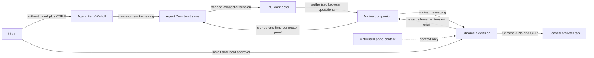

# Agent Zero Browser Bridge Pairing and Trust v1

Status: **Frozen architecture decision**  
Trust contract: `a0.browser-bridge.trust.v1`  
Canonical map: https://github.com/TerminallyLazy/agent-zero/issues/13  
Decision ticket: https://github.com/TerminallyLazy/agent-zero/issues/15  
Depends on: #12 and #14

## 1. Scope

This document defines how a user authorizes one host companion and Chrome
extension to connect to one Agent Zero instance, how that identity is used on
the existing connector, and how browser site and action permissions are
enforced and audited.

It covers:

- WebUI-first and A0 CLI-first pairing;
- companion and extension identity;
- a sender-bound connector principal;
- scope and event authorization;
- credential storage, rotation, revocation, and recovery;
- site access and consequential-action approval;
- context, browser-session, and lease authorization;
- bounded audit and diagnostic records.

It does not define installer packaging, the final settings/side-panel layout,
enterprise managed policy, or a general Agent Zero multi-user authorization
system.

The terms MUST, MUST NOT, SHOULD, SHOULD NOT, and MAY are normative.

## 2. Verdict

1. A paired companion is a distinct `browser_bridge` principal. It is not a
   WebUI session and it never receives the global Agent Zero/MCP API key.
2. The companion generates an Ed25519 key pair. Agent Zero stores the public
   key and fixed scopes; the host stores the private key. No reusable bearer
   credential crosses the network.
3. Pairing uses a user-created, 5-minute, single-use, high-entropy code. The
   code authorizes registration of one public key and then becomes invalid.
4. Every connector session uses a fresh, single-use server challenge signed by
   the paired private key. The proof is bound to the Agent Zero instance,
   normalized base URL, connector protocol, and allowed handler.
5. The native companion accepts only exact extension origins registered in its
   native-host manifest and verifies Chrome's caller-origin argument before it
   reads a protocol message.
6. Agent Zero owns durable site policy and action approvals. The extension
   independently blocks locally unexpected origins or higher-risk actions.
   The stricter decision always wins.
7. Persistent site allow/block decisions are shared by the current Agent Zero
   subject across chats. One-time and task grants are bound to their exact
   context, turn, companion, and origin.
8. Consequential-action approvals are one-operation grants. V1 has no persistent
   “always allow purchases/submissions/deletes” control.
9. Non-loopback Agent Zero connections require valid HTTPS. Plain HTTP is
   allowed only for loopback origins such as a host-published local Docker port.

## 3. Trust boundaries



### 3.1 Trusted for authorization

- An authenticated Agent Zero WebUI session with a valid CSRF token may create,
  inspect, rotate, and revoke bridge credentials and persistent site policy.
- A connector socket proven by a paired companion key may perform only the
  fixed browser-bridge scope set recorded for that key.
- The official extension service worker and native companion are trusted to
  faithfully relay a local approval click. The server still validates the
  challenge identity and scope.

### 3.2 Not authorization sources

- Agent/model text and browser tool arguments are action proposals, not grants.
- Page DOM, accessibility names, scripts, messages, selected text, and
  navigation content are untrusted.
- The presence of Chrome host permissions does not grant Agent Zero site access.
- Extension or companion self-reported versions and build hashes are diagnostic
  facts, not remote attestation.
- `Origin` and `Referer` headers from the native companion are defense-in-depth,
  not credentials.

## 4. Threat model

| Threat | V1 control |
|---|---|
| Pairing-code guessing | 160 random bits, 5-minute expiry, rate limits, generic failures. |
| Pairing-code replay | Atomic single use; any successful exchange consumes it. |
| Pairing phishing or wrong server | Code is created inside the authenticated WebUI; both surfaces show the exact server label, normalized base URL, and instance fingerprint. |
| Stolen network credential | There is no reusable bearer token; each connection requires a fresh Ed25519 proof. |
| Captured proof replay | Server challenge and client nonce are single-use and bound to one bridge and Agent Zero instance. |
| Malicious extension | Native manifest and runtime checks accept exact extension origins only; no wildcard or web-page native access. |
| Malicious webpage | Content scripts cannot call native messaging; runtime messages are schema checked and sender/tab/lease bound. Page content never resolves policy. |
| Confused-deputy scope escalation | The `browser_bridge` principal has a fixed event allowlist and cannot activate file, shell, code execution, Computer Use, settings, or admin paths. |
| Ambient WebUI-cookie escalation | When bridge proof is supplied, the socket is a bridge principal even if cookies are also present; cookie privilege is ignored. |
| Cross-chat tab control or cleanup | Browser sessions and leases are bound to bridge, context, turn, extension load generation, and exact tab handle. |
| Unexpected cross-origin redirect | The tab is quarantined before content inspection or further input and a new site challenge is required. |
| Companion/private-key theft | Host credential protection, least privilege, visible last-use audit, rotation, and immediate server revocation. A process with the user's local account remains inside the host trust boundary. |
| Server compromise | The server can intentionally issue browser operations; local disconnect/revocation and visible extension state are the containment controls. |
| Sensitive-data leakage in logs | Purpose-built audit projections, origin-only URLs, bounded strings, and no form values, page bodies, secrets, or raw artifacts. |
| Cleartext network interception | Valid HTTPS is mandatory off loopback; redirects, invalid certificates, and embedded URL credentials fail closed. |

## 5. Identities and records

### 5.1 Stable identifiers

| Identifier | Meaning |
|---|---|
| `server_instance_id` | Agent Zero's persistent runtime identity, derived from its existing persistent ID. |
| `subject_id` | Authorizing Agent Zero subject. V1 maps current single-user instances to `single_user`. |
| `pairing_id` | One short-lived pairing intent. |
| `bridge_id` | One paired host companion identity. |
| `key_generation` | Monotonic generation of the companion signing key. |
| `companion_instance_id` | Stable local installation identity reported by the companion. |
| `extension_id` | Exact Chrome extension ID allowed by native messaging. |

Every browser session created through the bridge is durably associated with its
`bridge_id`; changing connector sockets does not change ownership.

### 5.2 Server credential record

Agent Zero stores a record equivalent to:

```json
{
  "trust_version": 1,
  "bridge_id": "b6ce74df-47e6-4a3d-b8dd-3f3fae0e79d2",
  "server_instance_id": "opaque-persistent-server-id",
  "subject_id": "single_user",
  "display_name": "Taylor's MacBook Pro",
  "companion_instance_id": "9a58da19-faf7-42ba-8175-224a2b6c8bf3",
  "extension_id": "published-extension-id",
  "public_key": {
    "algorithm": "Ed25519",
    "encoding": "raw-base64url",
    "value": "base64url-encoded-32-byte-public-key"
  },
  "key_generation": 1,
  "scopes": [
    "bridge.connect",
    "context.list",
    "context.read",
    "context.message",
    "browser.operate",
    "browser.control",
    "browser.artifact",
    "browser.approval"
  ],
  "state": "active",
  "created_at_ms": 1788492400000,
  "last_authenticated_at_ms": 1788492445000,
  "revoked_at_ms": null
}
```

The server stores no companion private key or equivalent reusable symmetric
secret. Public keys, bridge records, policy, and audit data belong to durable
`_a0_connector`-owned state under Agent Zero's persistent user-data boundary,
not bundled plugin defaults.

### 5.3 Companion credential storage

The companion generates the private key locally and never exports it to the
extension, Agent Zero, logs, subprocess arguments, environment variables, or
stdout.

Storage order is:

1. macOS Keychain;
2. Windows Credential Manager/DPAPI;
3. Linux Secret Service;
4. an explicit file-protected fallback in the user's companion application-data
   directory, mode `0600`, when no desktop secret service is available.

The fallback is visible as **File-protected credential** in status and requires
an explicit setup acknowledgement. Refusing the fallback leaves pairing blocked
with remediation; it never silently writes a plaintext key.

Only the companion process reads the key. The A0 CLI may invoke installation or
pairing but does not persist a copy.

## 6. Pairing intent

### 6.1 Creation

An authenticated Browser settings page or authenticated A0 CLI session calls:

```text
POST /api/plugins/_a0_connector/browser_bridge_pairing
```

with a state-changing `create` action. Normal `ApiHandler` session authentication
and CSRF protection are mandatory, including when Agent Zero login is disabled.
The CSRF endpoint's existing same-origin/allowed-origin protections remain in
force.

The server creates one in-memory pairing record containing:

- `pairing_id`;
- SHA-256 of a 160-bit random pairing secret;
- `server_instance_id`, normalized external base URL, and `subject_id`;
- expected production extension ID, or an explicitly approved development ID;
- requested companion display label;
- creation/expiry time and attempt count.

The displayed code is a grouped, case-insensitive Crockford Base32 value:

```text
A0B1-<pairing-id-prefix>-<160-bit-secret>
```

The code expires after 5 minutes, has at most five failed exchanges, and is
single-use. A server restart invalidates every pending pairing intent. Only one
active intent per authenticated WebUI session is retained; creating another
invalidates the previous intent.

Responses use `Cache-Control: no-store` and never place the code in a URL,
query, fragment, referrer, analytics event, or application log. The UI may offer
copy and QR transfer but must keep the human-readable code visible for device
comparison.

### 6.2 Exchange

The extension passes the user-entered code and chosen Agent Zero base URL to the
companion through `pairing.exchange`. The code is held in transient memory only
and cleared after the response.

The companion:

1. validates and normalizes the URL;
2. requires HTTPS unless the hostname is loopback;
3. rejects URL userinfo, fragments, certificate errors, cross-origin redirects,
   and an unapproved reverse-proxy path change;
4. generates its Ed25519 key pair;
5. verifies Chrome's exact caller origin and includes that extension ID;
6. posts the code, public key, and bounded identity metadata to the issuing
   Agent Zero instance.

The unauthenticated exchange endpoint accepts the one-time code instead of a
WebUI cookie or CSRF token. It is POST-only, rate-limited by pairing intent and
coarse source class, and returns the same public failure for nonexistent,
expired, consumed, mismatched, or invalid codes.

The server atomically consumes the code and creates the bridge record. A success
response returns `bridge_id`, server identity, fixed scopes, policy summary, and
protocol versions. It returns no bearer secret or private key. If the response
is lost, the user creates a new pairing intent; the settings page can revoke the
unused record that appeared.

### 6.3 WebUI-first flow

1. The authenticated Browser settings page creates an intent.
2. It displays the exact Agent Zero origin, instance fingerprint, extension ID,
   intended host label, five-minute expiry, and code.
3. The user installs/opens the extension and pastes or scans the code.
4. The companion performs the exchange and signs its first connection proof.
5. Settings changes from **Waiting for companion** to **Paired**, showing the
   same bridge/host/extension identity and last-authenticated time.

The Docker container never writes a host native-messaging manifest, registry
key, credential store, or Chrome profile.

### 6.4 A0 CLI-first flow

1. `a0 browser-extension install` installs the same companion and exact native
   manifests for the selected Chromium family.
2. The CLI uses its existing authenticated Agent Zero session and CSRF flow to
   create the same pairing intent.
3. The current explicit human terminal command displays the five-minute code
   once with instructions to paste it into the approved Chrome Options page.
   Chrome owns the profile/install identity and passes it to its native session.
   A future profile-bound protected local rendezvous may automate this handoff;
   the CLI must not invent extension installation identity. JSON or redirected
   output creates no intent and reveals no code. Codes never enter arguments,
   environment, files, URLs, generic logs or JSONL status output.
4. The extension-owned companion performs the same exchange and persists the
   same key type. The CLI reports action-required until that browser step is
   completed, not a successful pairing based only on intent creation.
5. The CLI may exit. The companion/native-host lifecycle owns future sessions.

CLI and WebUI pairing therefore differ only in orchestration, not credential,
scope, server record, protocol, or trust.

## 7. Connector proof of possession

### 7.1 Challenge

Before opening `/ws`, the companion posts `bridge_id` and a fresh 32-byte client
nonce to the bridge-challenge endpoint. The endpoint is unauthenticated but
rate-limited and reveals no context, policy, or host data.

The server returns:

```json
{
  "trust_version": 1,
  "challenge_id": "8524b303-9b78-4381-a4fd-390bcd67b862",
  "server_nonce": "base64url-encoded-32-random-bytes",
  "server_instance_id": "opaque-persistent-server-id",
  "server_base_url": "https://agent.example.test/a0",
  "expires_at_ms": 1788492500000
}
```

Challenges expire after 60 seconds. They are memory-only, tied to one active
`bridge_id`, and consumed on the first proof attempt whether verification
succeeds or fails.

### 7.2 Signed proof

The companion signs this JSON Canonicalization Scheme object with Ed25519:

```json
{
  "aud": "opaque-persistent-server-id",
  "bridge_id": "b6ce74df-47e6-4a3d-b8dd-3f3fae0e79d2",
  "challenge_id": "8524b303-9b78-4381-a4fd-390bcd67b862",
  "client_nonce": "base64url-encoded-client-nonce",
  "handler": "plugins/_a0_connector/ws_connector",
  "protocol": "a0-connector.v1",
  "server_base_url": "https://agent.example.test/a0",
  "server_nonce": "base64url-encoded-server-nonce",
  "trust_version": 1
}
```

The signature uses raw Ed25519 as specified by RFC 8032 over UTF-8 RFC 8785 JCS
bytes. Binary values and the 64-byte signature use unpadded base64url. V1 has no
algorithm negotiation; an unknown algorithm fails closed.

The Socket.IO auth object includes the proof object and signature. The existing
`Origin` and `Referer` headers use the normalized Agent Zero origin, and reverse
proxy path handling preserves the configured base path.

### 7.3 Socket principal

At connection time Agent Zero:

1. validates its existing WebSocket origin checks;
2. loads an active bridge record;
3. atomically consumes the challenge;
4. verifies exact challenge fields, audience, base URL, handler, protocol, key
   generation, and signature;
5. creates a `_SecurityContext` whose principal type is `browser_bridge` and
   whose scopes come only from the server record;
6. activates only the connector handler and its bridge event filter.

An authenticated bridge socket is bound to its `bridge_id`, key generation,
subject, scopes, and Socket.IO SID until disconnect. It receives no session
cookie. If bridge proof is present, ambient cookies cannot upgrade the socket to
a WebUI principal.

This is a sender-bound connector credential, not OAuth. Its pairing-code and
challenge properties intentionally follow the single-use, expiry, explicit-user
review, least-privilege, and replay-resistance guidance in RFC 8628 and RFC 9700.

## 8. Scope and connector event authorization

V1 scopes are server-defined and fixed. The user cannot accidentally add file,
shell, code, settings, plugin, model, or general Computer Use authority during
pairing.

| Scope | Authority |
|---|---|
| `bridge.connect` | Authenticate and publish bounded companion/extension/browser capability metadata. |
| `context.list` | List bounded current-subject task summaries. |
| `context.read` | Subscribe to authorized context history/live events. |
| `context.message` | Create a task or send/queue a user message and authorized browser artifacts. |
| `browser.operate` | Receive browser operations and return typed results/events. |
| `browser.control` | Receive cancellation, finalization, challenge resolution, and reconciliation. |
| `browser.artifact` | Transfer only artifacts attached to browser operations or side-panel messages. |
| `browser.approval` | Relay an explicit local site/action approval for an existing server challenge. |

### 8.1 Allowed connector traffic

Companion-to-server events are limited to:

- `connector_hello`, with only browser-bridge metadata;
- bounded context list/subscribe/unsubscribe/send-or-queue events;
- `connector_browser_op_result`;
- `connector_browser_control_result`;
- `connector_browser_event`;
- browser artifact begin/chunk/end/abort events;
- an approval decision for a known browser challenge;
- credential status/rotation/self-revocation controls.

Server-to-companion events are limited to:

- bounded context list/snapshot/event/queue/complete/error payloads;
- browser operation, control, event acknowledgement, and artifact
  acknowledgement payloads;
- credential status/rotation result and forced-disconnect notice.

The bridge principal MUST NOT activate or send remote file, text-editor, remote
execution, Computer Use, Launcher gateway, settings, model, profile, plugin,
general API-key, or administrator events. Unknown or disallowed connector events
return `SCOPE_DENIED` and produce a bounded audit record.

`connector_hello` from a bridge principal rejects or removes `remote_files`,
`remote_exec`, `computer_use`, and `gateway` declarations even if a compromised
client supplies them. Legacy A0 CLI/WebUI session authentication remains
unchanged.

### 8.2 Context authorization

Current Agent Zero is a single-user application. V1 records the pairing subject
as `single_user` and permits that subject's paired bridge to list/create/read its
contexts. A future multi-user system must provide real context ownership before
issuing a non-single-user bridge principal; it cannot infer ownership from an
unguessable context ID.

Within the single-user trust domain:

- context summaries are bounded and contain no hidden configuration or secrets;
- project/profile choices must resolve through server-provided catalogs, never
  arbitrary paths;
- attachments must be completed bridge artifacts or already authorized safe
  Agent Zero references, never extension-supplied host paths;
- each browser session is pinned to one `bridge_id` and context;
- switching a live browser session to another bridge requires explicit release
  or finalization, not silent rerouting.

## 9. Native companion and extension identity

### 9.1 Native manifest

The installed native-host manifest lists exact origins:

```json
{
  "name": "io.agentzero.browser_bridge",
  "type": "stdio",
  "allowed_origins": [
    "chrome-extension://published-extension-id/"
  ]
}
```

Wildcards are forbidden by Chrome and by this contract. Production installers
register only the published ID. Development builds require an explicit installer
flag or development command naming the exact ID; adding it is visible in status
and audit. A development extension ID never migrates automatically into a
production credential.

At process start the companion validates Chrome's caller-origin argument before
reading stdin. It then requires the `bridge.hello` extension ID to match that
origin, the native manifest allowlist, and the paired bridge record. A mismatch
closes the port without server contact.

Content scripts cannot call native messaging. They send schema-limited messages
to the extension service worker, which verifies `sender.id`, `sender.tab.id`,
document/frame identity, active lease, and expected operation before relaying.

### 9.2 Chrome capability permission

The first release genuinely operates on arbitrary sites selected and approved
by the user. Its minimum planned high-risk permissions are therefore:

- `nativeMessaging`, `debugger`, `scripting`, `tabs`, `tabGroups`, `storage`,
  `alarms`, and `sidePanel`;
- `host_permissions` for `http://*/*` and `https://*/*`.

`activeTab` is insufficient because side-panel actions and agent-driven work are
not direct extension-action gestures. Broad Chrome host permission is a platform
capability only; Agent Zero's separate site policy below remains mandatory.

The extension does not request `cookies`, browser `history`, bookmarks,
top-sites, incognito, file-URL, or download-management permission unless a later
capability decision adds a user-visible feature and policy. It uses dynamic
injection on an approved leased tab instead of an always-running all-sites
content script.

If the user restricts Chrome host access, local permission denial wins and the
operation returns `CHROME_PERMISSION_REQUIRED`; Agent Zero never tells the user
that its own site grant overrides Chrome.

## 10. Site access policy

### 10.1 Origin identity

Site policy keys use normalized web origins only:

```text
scheme://ascii-lowercase-host[:non-default-port]
```

Paths, query strings, fragments, credentials, titles, favicon URLs, and page
content are not part of site identity. HTTP and HTTPS are different origins.
Internationalized hosts are normalized to ASCII/Punycode before comparison.

V1 does not allow wildcard domain grants. `example.com` and
`sub.example.com` require separate entries. Chrome-restricted schemes and pages
are never grantable.

### 10.2 Precedence and lifetime

The default mode is `ask_per_site`. Policy precedence is:

1. Chrome/restricted-page denial;
2. explicit persistent blocked origin;
3. active one-operation grant;
4. active context/turn grant;
5. persistent allowed origin;
6. explicit elevated-risk `allow_all_sites` mode;
7. challenge.

Persistent allowed and blocked origins are scoped to `subject_id` and shared
across that subject's chats and paired companions on the Agent Zero instance.
They are manageable from WebUI and side panel. A persistent block always wins.

User choices are:

- **Allow once**: one matching pending origin challenge; consumed immediately.
- **Allow for this task**: exact bridge, context, turn, and origin; expires at
  turn finalization or two hours, whichever comes first.
- **Always allow this site**: persistent exact origin for the subject.
- **Block this site**: persistent exact-origin denial.
- **Decline**: deny only the pending challenge.
- **Allow all sites**: separate elevated-risk global mode with explicit warning
  and confirmation; never selected by default or inferred from Chrome access.

Site access authorizes page inspection and ordinary navigation/interaction. It
does not authorize consequential actions, raw CDP, browser history, credential
access, or sensitive-data transmission.

### 10.3 Navigation transitions

- A direct navigation to an ungranted target origin is challenged before the
  request.
- A same-origin path/query/fragment change reuses the origin decision.
- An unexpected cross-origin redirect, popup, or script navigation may already
  have made a network request. The extension immediately quarantines the new
  document: it performs no inspection, cursor action, or input until the new
  origin is approved.
- A quarantined created tab remains leased and may be closed safely on denial.
  A claimed user tab remains open and is released on denial.
- Returning to a granted origin does not erase the audit record of the
  unexpected transition.

## 11. Consequential-action confirmation

Site approval and action confirmation are independent gates.

### 11.1 Risk classes

| Class | Examples | Default |
|---|---|---|
| `observe` | state/list/content/detail/screenshot, scroll, hover | Run after site grant. |
| `navigate` | open, direct navigation, back/forward, GET search | Run after site grant. |
| `reversible_input` | click ordinary controls, type non-sensitive text, select/check reversible UI | Run after site grant when locally consistent. |
| `sensitive_input` | password fields, secrets, health/financial/identity data, file selection | Confirm immediately before typing/upload because page script may observe the value. |
| `external_side_effect` | POST submission, send/publish, purchase/payment, delete, account/security change, subscription, download/upload, clipboard write | Confirm immediately before the effect. |
| `advanced_control` | arbitrary script evaluation or raw CDP method | Require separately enabled advanced capability plus per-operation policy. |
| `unknown` | ambiguous target or semantic disagreement | Treat as `external_side_effect`. |

Agent Zero supplies its expected class. The extension independently checks the
action, element semantics, form method, input type, accessible name, and current
document. If local classification is higher, it emits a challenge. If the server
class is higher, the extension honors it. Neither may downgrade the other.

Natural-language user instructions are not an action-confirmation receipt. A
request is pre-approved only when an authenticated UI created a structured grant
for the same exact action binding.

### 11.2 Grant binding

An approval receipt binds:

- `challenge_id`, `action_id`, and operation parameter hash;
- `bridge_id`, `context_id`, `browser_session_id`, and `turn_id`;
- extension load generation, tab handle, and document/navigation generation;
- exact origin, action class, and target-element fingerprint;
- a one-way hash/classification of proposed transmitted data, never its raw
  value;
- approving surface, subject, decision time, and two-minute expiry.

The choices are **Allow this action** and **Decline**. Repeated consequential
actions require separate receipts. DOM/document changes, different data, expiry,
disconnect, cancellation, or finalization invalidate the receipt.

Approvals from WebUI use session authentication plus CSRF. Approvals from the
side panel travel extension -> exact native companion -> authenticated bridge
socket. The server accepts a decision only for a currently pending challenge
owned by that bridge/context/turn.

## 12. Context, session, and lease enforcement

The server records `bridge_id` on browser-session creation. Every operation,
control, challenge, artifact, event, and finalization must resolve through that
same bridge association in addition to the identifiers in protocol v1.

- A connector SID may replace an older SID for the same active bridge after a
  valid fresh proof; it cannot inherit another bridge's sessions.
- Two bridges cannot concurrently own the same browser session.
- A context may use more than one bridge only through separate browser sessions
  explicitly selected by the server/user.
- A tab lease created under bridge A cannot be acted on, finalized, or reclaimed
  by bridge B.
- Claimed-tab identity and created-tab lease invariants from protocol v1 remain
  authoritative.
- Revocation prevents new operations immediately. Cleanup is requested only
  through the revoked bridge's still-proven local extension and never guesses
  tabs if that channel is gone.

## 13. Audit, projection, and privacy

### 13.1 Two records

1. Existing Agent Zero chat history remains the user-facing conversation and
   tool-result record.
2. A separate bounded browser security audit records pairing, authentication,
   site/action policy, bridge routing, and lease outcomes.

The security audit defaults to the newest 10,000 entries or 90 days, whichever
is smaller. Users can inspect, export, and clear it from Browser settings.
Credential revocation records survive ordinary audit clearing as part of the
credential record.

### 13.2 Allowed audit fields

- timestamp and event type;
- `bridge_id`, companion label, extension ID/version, and key generation;
- context/turn/browser-session/action/challenge/lease correlation IDs;
- action name and risk class;
- normalized origin only;
- decision/result/error code and outcome certainty;
- source surface (`webui`, `side_panel`, `cli`, `system`);
- bounded version/capability/status metadata.

### 13.3 Forbidden audit/log fields

- private keys, pairing secrets, challenge signatures, session cookies, API
  keys, headers, or raw authorization objects;
- paths, URL query/fragment/userinfo, full referrers, page titles, page bodies,
  screenshots, DOM/accessibility content, selectors, form values, clipboard
  data, scripts, or attachment bytes;
- raw passwords, secrets, health/financial/identity values, or data hashes that
  would permit practical dictionary recovery;
- unfiltered exceptions or native stdout.

Native protocol stdout carries framing only; diagnostics go to bounded stderr
or protected rotating logs after redaction.

### 13.4 Connector context projection

The existing connector event bridge can expose log `meta`, and the current
Browser tool log includes raw tool arguments. A browser-bridge principal MUST
receive a purpose-built projection:

- user and assistant conversation text remains visible because `context.read`
  explicitly authorizes the side-panel conversation;
- browser tool metadata removes typed text, scripts, clipboard content, local
  paths, selectors, raw URLs beyond normalized origin, and secret-like values;
- the projection keeps action, safe target label, status, correlation IDs,
  artifact descriptors, and redacted receipts;
- truncation happens before native framing, persistence in extension storage,
  or UI rendering.

Generic secret masking alone is insufficient because ordinary form text and
paths may be sensitive without appearing in Agent Zero's secrets file.

The extension stores no conversation transcript or page content in
`chrome.storage.local` or sync storage. Side-panel presentation state is
ephemeral. Current-generation lease/receipt working state remains bounded in
`storage.session`; decision #18 additionally requires a bounded, redacted local
WAL containing only non-content ownership metadata, mutation/control
tombstones, and unacknowledged critical events needed for safe recovery.

## 14. Rotation, revocation, and lifecycle

### 14.1 Key rotation

Rotation is explicit and interruption-safe:

1. The authenticated companion generates and securely stores a new Ed25519 key
   beside the current key.
2. Over the current proven connector session it requests a pending next
   generation and supplies the new public key.
3. Agent Zero creates a 10-minute pending generation with identical subject,
   bridge identity, extension ID, and scopes; scope expansion is forbidden.
4. The companion authenticates a second connection using the new key and a fresh
   challenge.
5. On first valid proof Agent Zero activates the new generation, stops issuing
   new work to the old SID, allows at most 120 seconds for an already-running
   operation to reach a truthful terminal outcome, then revokes the old key.
6. The companion deletes the old private key after activation confirmation.

If step 4 never succeeds, the pending generation expires and the old key remains
active. Repeating rotation is idempotent by `rotation_id`.

Companion reinstall, key-store loss, extension-channel change, or suspected
compromise should create a new pairing and revoke the old bridge rather than
copying private key material.

### 14.2 Revocation

An authenticated WebUI/CLI session may revoke any bridge. A proven bridge may
self-revoke. Revocation:

- atomically marks the bridge and all key generations revoked;
- consumes outstanding connector challenges and pairing/rotation intents;
- refuses new sockets and new operations;
- sends a forced-disconnect notice to active SIDs;
- cancels pending actions and records truthful outcome certainty;
- requests safe protocol-v1 lease finalization while the exact extension
  generation is still reachable;
- never closes claimed or weakly identified tabs;
- remains durable across server restart.

If the companion cannot reach the server during local **Disconnect**, it deletes
its key only after warning that the server-side record remains. The UI directs
the user to revoke that stale bridge from Agent Zero settings when reachable.

### 14.3 Recovery states

| Condition | Result |
|---|---|
| Ordinary service-worker restart | Pairing and load generation remain; native hello and exact protocol reconciliation resume. |
| Extension reload/update or disable/re-enable | Pairing remains; session state is cleared, a new load generation is created, and prior tabs become retained orphans. |
| Chrome restart | Pairing remains; session state is cleared and old tab generations become protocol-v1 orphans. |
| Companion restart | Pairing remains if key storage is available; obtain a fresh connector challenge. |
| Agent Zero process restart | Pairing remains; pending pairing and connector challenges expire. |
| Agent Zero persistent ID changes | Audience mismatch; show **Different Agent Zero instance** and require pairing. |
| Private key missing/corrupt | Show **Pairing repair required**; no bearer fallback. |
| Extension ID mismatch | Native connection rejected; installer repair or explicit new pairing. |
| TLS/certificate failure off loopback | Connection blocked; no “trust permanently” bypass in v1. |
| Credential revoked | Side panel becomes unpaired; local private key is deleted after authenticated revocation notice. |

## 15. Endpoint and status boundary

Planned Agent Zero endpoints remain inside `_a0_connector`:

| Endpoint concept | Authentication |
|---|---|
| Pairing create/status/cancel | WebUI session + CSRF. |
| Bridge list/detail/revoke | WebUI session + CSRF for mutations. |
| Persistent site-policy get/set | WebUI session + CSRF for mutations. |
| Pairing exchange | Single-use pairing code; no ambient cookie authority. |
| Connector challenge | Active `bridge_id`, rate limit; returns nonce only. |
| Security audit list/clear | WebUI session + CSRF for clear. |

The exact filenames and UI composition are implementation decisions, but every
state-changing browser endpoint must follow Agent Zero's `ApiHandler` auth/CSRF
contract unless this document explicitly defines the one-time pairing or
proof-of-possession alternative.

The status model is:

`uninstalled`, `native_host_missing`, `unpaired`, `pairing_pending`, `paired`,
`connecting`, `connected`, `reconnecting`, `permission_required`,
`policy_blocked`, `rotation_pending`, `revoked`, and `repair_required`.

Status is layered. Server, credential, companion, extension, Chrome permission,
and site policy readiness are reported separately; one green aggregate label
must not hide a failed layer.

## 16. Conformance gates

Implementation is not trust-v1 compatible until automated tests prove:

1. Pairing creation requires an authenticated session and valid CSRF token.
2. Pairing codes have at least 160 random bits, expire in 5 minutes, and never
   appear in logs or URLs.
3. One successful exchange consumes the code atomically under concurrency.
4. Invalid/expired/consumed/mismatched exchanges have indistinguishable public
   failures and enforced rate limits.
5. Pairing over non-loopback HTTP, invalid TLS, URL userinfo, or cross-origin
   redirect fails closed.
6. Exchange stores one Ed25519 public key and returns no bearer/private secret.
7. The extension never stores a reusable server credential.
8. Native manifest origins are exact and runtime caller/hello IDs must match.
9. A fresh signed challenge authenticates the intended bridge.
10. A replayed, expired, already-attempted, wrong-audience, wrong-origin,
    wrong-handler, wrong-generation, or malformed proof fails.
11. Ambient WebUI cookies cannot upgrade a bridge-principal socket.
12. A bridge principal cannot activate or send file, exec, Computer Use,
    Launcher, settings, model, plugin, or administrator events.
13. A malicious `connector_hello` cannot advertise scopes outside the server
    bridge record.
14. Legacy WebUI-session and A0 CLI connector authentication remains unchanged.
15. A browser session and lease cannot move between bridge principals.
16. Persistent blocked origins beat all allow modes.
17. Direct ungranted navigation challenges before request.
18. Unexpected redirected origins quarantine before content inspection/input.
19. Site approval never authorizes a consequential action.
20. Higher local or server risk classification wins; unknown is consequential.
21. Action receipts fail after document, element, data, action, turn, bridge, or
    expiry mismatch.
22. Sensitive input is challenged before typing, not only before form submit.
23. Browser context projection removes typed text, scripts, paths, selectors,
    and full URLs while retaining useful receipts.
24. Security audit records only allowed fields and obeys the retention cap.
25. Successful rotation activates the new key before revoking the old; failed
    rotation leaves the old key working.
26. Revocation prevents new work, disconnects the exact bridge, and never closes
    claimed or weakly identified tabs.
27. Server restart preserves bridge records/revocations but invalidates pairing
    intents and connector challenges.
28. Browser and extension restart do not require re-pairing when host key and
    server identity are unchanged.
29. WebUI-first and CLI-first fixtures produce equivalent bridge records and
    scopes.
30. Chrome host-permission denial remains visible and cannot be overridden by an
    Agent Zero site grant.

## 17. Implementation anchors and constraints

- Extend the existing connector security context with an explicit principal and
  scopes; do not set `WsConnector.requires_auth()` to false.
- Keep pairing/policy helpers plugin-local unless a reusable principal mechanism
  is deliberately added to `helpers/api.py` or `helpers/ws.py` with matching DOX
  and security tests.
- Use `runtime.get_persistent_id()` as the server audience anchor.
- Keep pending pairing and proof challenges in bounded runtime memory. Persist
  bridge public records, revocations, policy, and audit under Agent Zero user
  state.
- Apply event authorization before `WsConnector.process` dispatch and before
  outbound subscription/routing.
- Preserve current `validate_ws_origin` checks as defense-in-depth.
- Add purpose-built bridge context-event projection before emitting to a bridge
  SID.
- Existing A0 CLI session-cookie behavior remains a setup/auth path only; the
  standalone companion uses its paired proof identity.
- Changes to `helpers/ws.py` or other direct helpers require their `.dox.md`
  updates and `tests/test_ws_security.py` coverage. New plugin API handlers need
  explicit auth/CSRF behavior and focused pairing security tests.

## 18. Deferred decisions

- Exact companion packaging, signing, updater, service lifecycle, and OS-specific
  credential adapter implementation.
- Final WebUI and side-panel layout/copy and QR rendering.
- Enterprise managed origin policy and administrator-enforced extension IDs.
- Real multi-user subject/context ownership in Agent Zero.
- Optional browser history, downloads management, incognito, and file-URL access.
- Hardware-backed keys or standards-compliant OAuth/DPoP if Agent Zero later
  becomes a multi-user authorization server.
- Cross-device policy synchronization outside one Agent Zero instance.

## 19. Research basis

Public platform and security sources:

- [Chrome native messaging](https://developer.chrome.com/docs/extensions/develop/concepts/native-messaging)
- [Chrome permission declarations](https://developer.chrome.com/docs/extensions/develop/concepts/declare-permissions)
- [`chrome.scripting`](https://developer.chrome.com/docs/extensions/reference/api/scripting)
- [RFC 8628: OAuth 2.0 Device Authorization Grant](https://www.rfc-editor.org/rfc/rfc8628.html)
- [RFC 9700: OAuth 2.0 Security Best Current Practice](https://www.rfc-editor.org/rfc/rfc9700.html)
- [RFC 8032: Ed25519](https://www.rfc-editor.org/rfc/rfc8032.html)
- [RFC 8785: JSON Canonicalization Scheme](https://www.rfc-editor.org/rfc/rfc8785.html)

Agent Zero compatibility was traced through `helpers/api.py`, `helpers/ws.py`,
`helpers/login.py`, `helpers/runtime.py`, `helpers/kvp.py`,
`plugins/_a0_connector/api/ws_connector.py`,
`plugins/_a0_connector/helpers/ws_runtime.py`,
`plugins/_a0_connector/helpers/event_bridge.py`,
`plugins/_browser/tools/browser.py`, and the installed A0 CLI `A0Client` and
session-storage contracts.

The local first-party ChatGPT extension manifest was inspected only to confirm
the production precedent for MV3 native messaging, debugger, tab groups,
scripting, tabs, side panel, and broad web host access. No proprietary source,
assets, credentials, or implementation were copied.
