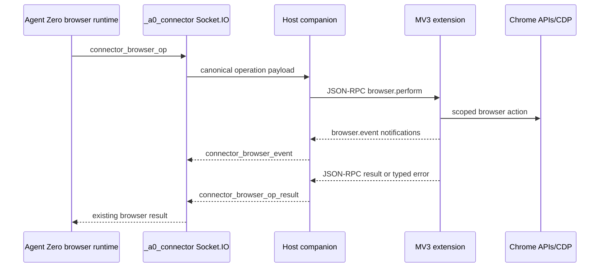

# Agent Zero Browser Bridge Protocol v1

Status: **Frozen architecture decision**  
Protocol name: `a0.browser-bridge.v1`  
Canonical map: https://github.com/TerminallyLazy/agent-zero/issues/13  
Decision ticket: https://github.com/TerminallyLazy/agent-zero/issues/14

## 1. Scope

This document defines the transport-neutral browser operation contract and its
two bindings:

1. Agent Zero server to host companion over the existing authenticated
   `_a0_connector` Socket.IO namespace.
2. Host companion to the Manifest V3 Chrome extension over Chrome native
   messaging.

The contract covers negotiation, companion pairing/status, the minimal
side-panel context relay, browser actions, task/turn identity, tab leases, task
groups, visible cursor activity, confirmations, cancellation, artifacts,
finalization, and reconnect reconciliation. The context relay binds to existing
`_a0_connector` events; it does not redefine Agent Zero chat semantics.

It does not define installer packaging, final UI composition, the complete site
policy data model, or a general-purpose raw CDP proxy.

The terms MUST, MUST NOT, SHOULD, SHOULD NOT, and MAY are normative.

## 2. Architectural invariants

- Agent Zero remains authoritative for task intent, user policy, confirmation
  decisions, cancellation, and final tab disposition.
- The extension remains authoritative for Chrome-local tab identity, debugger
  attachment state, task groups, cursor rendering, and lease enforcement.
- The companion is a transport, credential, artifact-spooling, and installation
  boundary. It MUST NOT invent browser actions or approval decisions.
- The existing Agent Zero `browser` tool remains the only agent-facing browser
  API. The bridge does not expose a second `chrome_bridge` tool.
- Claimed user tabs are never closed by automatic finalization.
- Only tabs created under a matching active Agent Zero lease are eligible for
  automatic close.
- Unknown versions, capabilities, ownership, or action outcomes fail closed.
- Browser work MUST continue when the extension side panel is closed.

## 3. Protocol layering



The canonical operation and result objects are the same at both boundaries.
Socket.IO uses named connector events. Native messaging wraps the canonical
objects in JSON-RPC 2.0.

## 4. Compatibility and negotiation

### 4.1 Version rule

`contract_version` is an integer major version. Version 1 accepts additive
optional fields. Removing a field, changing its meaning, or weakening an
invariant requires a new major version.

Unknown optional fields MUST be ignored. Unknown methods, actions, enum values,
or required capabilities MUST produce a typed error.

### 4.2 Native handshake

Immediately after `chrome.runtime.connectNative`, the extension sends:

```json
{
  "jsonrpc": "2.0",
  "id": "7f5cbdec-3f4f-4d44-9ea1-e00f0ac06db8",
  "method": "bridge.hello",
  "params": {
    "protocol": "a0.browser-bridge",
    "contract": { "min": 1, "max": 1 },
    "extension": {
      "id": "published-extension-id",
      "version": "0.2.0",
      "manifest_version": 3,
      "install_instance_id": "3b7467f5-36bd-4967-ad9d-78fba9c1af35",
      "load_generation_id": "64d030c5-9fca-4606-9a7c-c2b2f9e0d27f"
    },
    "browser": { "family": "chrome", "version": "146.0.0.0" },
    "capabilities": {
      "actions": ["open", "list", "state", "navigate", "click"],
      "features": ["tab_leases_v1", "tab_groups_v1", "cursor_v1"],
      "cdp_domains": ["Accessibility", "DOM", "Input", "Page", "Runtime"]
    },
    "resume": {
      "event_cursors": [
        {
          "load_generation_id": "64d030c5-9fca-4606-9a7c-c2b2f9e0d27f",
          "last_acked_event_sequence": 41
        }
      ],
      "inflight_op_ids": [],
      "lease_digest": "sha256:..."
    }
  }
}
```

The companion validates the actual native caller origin against its registered
extension allowlist before accepting the declared extension ID. It returns:

```json
{
  "jsonrpc": "2.0",
  "id": "7f5cbdec-3f4f-4d44-9ea1-e00f0ac06db8",
  "result": {
    "protocol": "a0.browser-bridge.v1",
    "contract_version": 1,
    "connection_id": "96ae83aa-e948-4687-b0e8-9452a64b319c",
    "companion": {
      "instance_id": "65575887-59bd-455b-8611-c599c33f0f84",
      "version": "0.1.0",
      "platform": "darwin",
      "arch": "arm64"
    },
    "server": {
      "state": "paired",
      "instance_id": "opaque-server-id",
      "label": "Agent Zero"
    },
    "limits": {
      "max_json_frame_bytes": 786432,
      "artifact_chunk_bytes": 196608,
      "max_artifact_bytes": 26214400
    }
  }
}
```

If there is no common contract version, the result is a `VERSION_MISMATCH`
error. No browser operation may run on an unnegotiated connection.

### 4.3 Connector hello binding

The companion retains `protocol: "a0-connector.v1"` for the outer connector and
adds an extension backend to the existing `host_browser` declaration:

```json
{
  "host_browser": {
    "supported": true,
    "enabled": true,
    "status": "ready",
    "backend_id": "chrome_extension",
    "browser_id": "extension:3b7467f5-36bd-4967-ad9d-78fba9c1af35",
    "browser_label": "Chrome — Agent Zero Extension",
    "contract_version": 1,
    "features": ["browser_extension_bridge_v1"],
    "capabilities": {
      "actions": [],
      "features": [],
      "limits": {}
    },
    "extension": {},
    "companion": {}
  }
}
```

Actual negotiated actions and metadata replace the empty example values. Legacy
clients without `backend_id`, `contract_version`, or `capabilities` remain valid
CDP/Playwright candidates. The server MUST dispatch only actions advertised by
the selected backend.

The outer connector advertises these additive features:

- `browser_extension_bridge_v1`
- `connector_browser_control`
- `connector_browser_event`
- `connector_browser_artifact_chunks`

### 4.4 Legacy operation compatibility

The existing connector browser payload is flat: action arguments sit beside
`op_id`, `context_id`, and `action`. A negotiated v1 extension backend uses the
canonical nested `args` request in section 7.

- A request with `contract_version: 1` MUST use `args`; conflicting legacy flat
  action fields are rejected as invalid parameters.
- A request without `contract_version` retains the existing flat meaning and
  may be sent only to a legacy CDP/Playwright backend.
- The Agent Zero server selects the encoding from the backend metadata in
  `connector_hello`; the companion and extension never guess from field shape.
- Legacy results remain `{op_id, ok, result}` or `{op_id, ok: false, error}`.
  The server ignores absent v1 receipt, artifact, and outcome metadata.

This keeps current A0 CLI host-browser clients working while making the v1
contract unambiguous.

## 5. Identifier model

Every identifier is an opaque case-sensitive string. UUIDs are recommended.

| Identifier | Lifetime and meaning |
|---|---|
| `context_id` | Existing Agent Zero chat/task context. |
| `browser_session_id` | Stable browser workspace for one Agent Zero context. It owns the task-group intent across turns. |
| `turn_id` | One Agent Zero monologue/run. Finalization occurs at this boundary, not after every tool iteration. |
| `action_id` | Stable idempotency identity for one logical action across transport retries. |
| `op_id` | One transport attempt. Exactly one terminal result is accepted for it. |
| `control_id` | Idempotency identity for cancel, finalize, reconcile, or challenge-resolution control. |
| `lease_id` | Ownership record for one claimed or created tab. |
| `candidate_handle` | Short-lived, generation-bound reference to a user-selected tab. It conveys no control authority until an internal `claim` succeeds. |
| `tab_handle` | Extension-load-generation-bound opaque target returned as the agent-facing `browser_id`. |
| `challenge_id` | One site/action/data confirmation challenge. |
| `artifact_id` | One bounded binary artifact transfer. |
| `event_id` | Globally unique event identity used for deduplication. |
| `event_sequence` | Monotonic sequence within one extension `generation_id`. |

`tab_handle` MUST include or resolve against the extension load generation. A
handle from a prior generation fails with `TAB_IDENTITY_MISMATCH`; it is never
matched by URL or title guessing. The installation identity, load generation,
and individual service-worker boot identity are distinct as defined by the MV3
runtime decision #18.

## 6. Native JSON-RPC binding

Native messaging uses JSON-RPC 2.0 request, response, error, and notification
objects. Batches are forbidden in v1. Method names are lowercase and
case-sensitive:

- `bridge.hello`
- `bridge.ping`
- `pairing.status`
- `pairing.exchange`
- `pairing.disconnect`
- `agent.status`
- `context.list`
- `context.subscribe`
- `context.unsubscribe`
- `context.send_message`
- `context.queue_add`
- `context.queue_remove`
- `context.queue_send`
- `context.queue_updated`
- `browser.approval_decision`
- `credential.rotate`
- `credential.status`
- `credential.revoke`
- `credential.changed`
- `context.snapshot`
- `context.event`
- `context.complete`
- `browser.perform`
- `browser.cancel`
- `browser.finalize_turn`
- `browser.resolve_challenge`
- `browser.reconcile`
- `browser.event`
- `browser.ack_events`
- `artifact.begin`
- `artifact.chunk`
- `artifact.end`
- `artifact.abort`

Every request receives exactly one response with the same JSON-RPC `id`.
Notifications have no `id` and receive no JSON-RPC response.

The companion and extension MUST support full-duplex, re-entrant RPC. For
example, an extension processing `browser.perform` may call `artifact.begin`
before returning the operation result.

### 6.1 Pairing and companion status

`pairing.status` is available before server pairing and returns only connection
state, server label/base origin, companion version, and actionable diagnostics.

`pairing.exchange` accepts a user-entered short-lived pairing code and the
chosen Agent Zero base origin. The companion performs the authenticated exchange
and stores the resulting browser-bridge-only credential in host credential
storage. Its response returns status and non-secret server identity only; the
extension never receives the credential.

`pairing.disconnect` revokes or removes the companion's scoped credential after
an explicit user action. It does not uninstall the extension or companion.

`agent.status` returns the paired server's reachability, version, active context
summary, selected browser backend, and policy readiness. No status response may
include tokens, cookies, headers, page content, or user-message bodies.

The exact WebUI endpoints and installer UX that mint and revoke pairing codes
remain a later trust/frontier decision. These native method shapes are frozen so
that setup cannot require an Agent Zero API key in extension storage.

### 6.2 Side-panel context relay

The companion maps these native methods directly to the existing authenticated
connector session:

| Native method | Existing connector binding |
|---|---|
| `context.subscribe` | `connector_subscribe_context` |
| `context.unsubscribe` | `connector_unsubscribe_context` |
| `context.send_message` | `connector_send_message` |
| `context.snapshot` notification | `connector_context_snapshot` |
| `context.event` notification | `connector_context_event` and `connector_message_queue_updated` |
| `context.complete` notification | `connector_context_complete` and `connector_context_error` |

`credential.rotate/status/revoke` are explicit production-only native requests
whose Chrome parameters are exactly `{contract_version:1}`. The native host
generates and securely stages rotation ID and private key before submitting
`connector_bridge_credential_control`. Rotate data is exactly version, action,
rotation ID and `public_key:{algorithm:"Ed25519",encoding:"raw-base64url",value}`;
status data is version/action/retained rotation ID; revoke data is version/action.
Core receipts contain exactly version/action/rotation ID (null for revoke),
key generation (1..2147483647), status pending/active/expired/revoked and expiry
(integer for pending, null otherwise). Native never deletes the active key on
a pending or uncertain response. A fresh candidate-signed admitted handshake
confirms promotion; expiry is cleared only after an authoritative Core receipt.
The durable `connector_bridge_credential_status` revoke notification maps to
`credential.changed`, or settles that port's explicit pending revoke before
shutdown. The shared `credential-control-v1.json` fixture freezes these shapes.
No private seed, caller-supplied public key or key-store path crosses into Chrome.

`context.list` is a bounded companion view of contexts already authorized and
advertised by the paired Agent Zero instance. The additive production-only
queue methods map to `connector_message_queue_add/remove/send`: add requires
version 1, context ID, stable client message ID and text; remove/send require
version 1, context ID and the exact returned item ID. No clear-all, host paths,
attachments or foreign queue items are accepted. A hash-only durable journal
prevents repeated enqueue/send effects; uncertain effects never retry. The
`context.queue_updated` notification carries only version 1, context ID and at
most 32 owned `message_queue` previews (ID, at most 100 characters, empty
attachments and zero attachment count). It has no invented log cursor.

`browser.approval_decision` maps to the same-named connector approval event and
accepts only version 1, an existing challenge ID, `kind: site|action` and the
corresponding explicit decision. Site options are deny/allow_once/allow_turn;
action options are decline/approve_once. The trusted worker requires a matching
current selected-chat challenge; Core independently matches the retained exact
principal, socket and load generation. No caller receipt or grant is accepted.
Responses preserve Core's public accepted control projection, not an assertion
that Chrome applied the action. These additions are documented in the shared
`context-queue-approval-v1.json` cross-language fixture and do not widen the
separate limited-development runtime.

`context.list` is a bounded companion view of contexts already authorized and
advertised by the paired Agent Zero instance; it does not grant access to an
arbitrary context ID. `context.subscribe` preserves the connector's `from`,
`history`, and `history_before` pagination semantics. The companion assigns a
correlation ID and returns the connector acknowledgement unchanged apart from
transport-envelope fields.

`context.send_message` requires a stable `client_message_id`, accepts a bounded
text message, optional completed input `artifact_id` values, and optional
`tab_candidates` explicitly selected in the side panel. Each candidate contains
only its short-lived `candidate_handle`, bounded user-visible label, normalized
origin, and expiry; it grants no browser authority until the server dispatches
internal `browser.perform action=claim`. The companion maps artifacts to
authorized attachment references and never accepts raw host filesystem paths
from the extension.

Snapshots remain paged. Before forwarding, the companion splits or truncates a
connector page so every native frame remains below the section 13 limit; it MUST
NOT silently drop the pagination cursor or completion state. Closing the side
panel only unsubscribes its presentation stream. It does not cancel the Agent
Zero turn, close the native port owned by the service worker, or finalize tabs.

## 7. Browser operation

### 7.1 Canonical request

`browser.perform` params are:

```json
{
  "contract_version": 1,
  "op_id": "5a986115-b4bf-4fc5-9557-85a3129bce69",
  "action_id": "3146a626-c28a-4c6e-bd5a-f80e80655c18",
  "context_id": "opaque-context",
  "browser_session_id": "2a6aca65-a181-41d9-b1b9-2868d39df3df",
  "turn_id": "b8aa179a-e073-45fe-85f0-440f4fad0d72",
  "action": "click",
  "target": { "tab_handle": "a0t1.r4Nd0mGen.r4Nd0mLease" },
  "args": { "ref": "frame0:node24" },
  "timeout_ms": 120000,
  "required_capabilities": ["click", "cursor_v1"],
  "policy": {
    "origin_grant_id": "optional-grant-id",
    "action_grant_id": null
  },
  "display": { "cursor": true, "foreground": false }
}
```

Rules:

- `op_id`, `action_id`, `context_id`, `browser_session_id`, and `turn_id` are
  required for every action except connection-level `status`/`ensure`.
- `args` is action-specific and MUST be an object.
- `timeout_ms` is duration from receipt at each hop, capped at 120 seconds in v1.
- The receiver validates all `required_capabilities` before applying the action.
- The extension serializes operations per lease/tab and may run operations on
  different leases concurrently.
- Lifecycle and confirmation controls are forbidden inside `multi`.
- Each `multi` child receives its own `action_id`; ordered results match input
  order even when different tabs execute concurrently.

### 7.2 Action compatibility

The v1 action vocabulary preserves the current Agent Zero Browser surface:

`open`, `list`, `state`, `set_active`, `navigate`, `back`, `forward`, `reload`,
`content`, `detail`, `evaluate`, `click`, `type`, `submit`, `type_submit`,
`scroll`, `hover`, `double_click`, `right_click`, `drag`, `wheel`, `mouse`,
`keyboard`, `key_chord`, `clipboard`, `set_viewport`, `select_option`,
`set_checked`, `upload_file`, `screenshot`, `close`, `close_all`, `multi`,
`ensure`, and `status`.

The extension binding additionally accepts internal action `claim`. It consumes
a short-lived `candidate_handle` minted for an explicitly selected/mentioned
user tab, revalidates the captured browser instance, provider tab/window ID,
title, and URL together, creates a claimed lease, and returns a normal
`tab_handle`. It is a transport prelude used by the existing Browser tool, not a
second agent-facing action.

`evaluate` and unrestricted CDP-dependent behavior require an explicit advanced
capability and policy grant. A backend may advertise only a subset.

For the extension backend:

- Agent-facing `browser_id` is the opaque `tab_handle`, not a raw Chrome tab ID.
- `list` returns targetable tabs already leased to the requesting
  `context_id`/`browser_session_id`. It neither exposes all personal tabs nor
  implicitly claims them. A user-selected/mentioned tab becomes targetable only
  through the explicit `candidate_handle` and internal `claim` flow.
- `close_all` means all matching agent-owned tabs in the current
  `browser_session_id`; it never means every Chrome tab.
- `open` creates an ephemeral leased tab unless the request explicitly supplies
  a later disposition.
- `set_active` or `display.foreground: true` may focus a tab. Other actions stay
  background-capable when Chrome permits it.

### 7.3 Success result

```json
{
  "contract_version": 1,
  "op_id": "5a986115-b4bf-4fc5-9557-85a3129bce69",
  "action_id": "3146a626-c28a-4c6e-bd5a-f80e80655c18",
  "status": "succeeded",
  "result": {},
  "receipts": [],
  "artifacts": [],
  "completed_at_ms": 1788492445123
}
```

The connector Socket.IO binding maps this to the compatible shape:

```json
{
  "contract_version": 1,
  "op_id": "5a986115-b4bf-4fc5-9557-85a3129bce69",
  "action_id": "3146a626-c28a-4c6e-bd5a-f80e80655c18",
  "ok": true,
  "result": {},
  "receipts": [],
  "artifacts": []
}
```

### 7.4 Idempotency and outcome certainty

- The extension journals the parameter hash and current-generation terminal
  receipt in `chrome.storage.session`. Before any mutation, it also persists a
  bounded, redacted write-ahead record and safe terminal tombstone in
  `chrome.storage.local` as defined by decision #18.
- Repeating an `action_id` with the same canonical parameter hash returns the
  same-generation cached terminal result without reapplying the action. After a
  generation reset, a read-only action whose sensitive result was not persisted
  may run again under the same ID; a mutation returns its durable safe receipt
  or `OUTCOME_UNKNOWN` and is never blindly reapplied.
- Repeating an `action_id` with different parameters fails with
  `IDEMPOTENCY_CONFLICT`.
- Read-only actions MAY be retried automatically with the same `action_id`.
- Mutating actions MUST NOT be automatically retried when the outcome is
  `unknown`. The caller must inspect current state or obtain user direction.

Every error declares one outcome:

- `not_applied`: safe for the caller to retry according to policy.
- `applied`: the side effect occurred even though a later step failed.
- `unknown`: the implementation cannot prove whether the side effect occurred.

## 8. Error contract

Native JSON-RPC uses standard parse/method/parameter codes and `-32010` for an
Agent Zero browser error:

```json
{
  "jsonrpc": "2.0",
  "id": "5a986115-b4bf-4fc5-9557-85a3129bce69",
  "error": {
    "code": -32010,
    "message": "The target tab no longer matches the claimed tab.",
    "data": {
      "a0_code": "TAB_IDENTITY_MISMATCH",
      "outcome": "not_applied",
      "retryable": false,
      "details": {}
    }
  }
}
```

Required v1 application codes include:

- `VERSION_MISMATCH`
- `NOT_PAIRED`
- `PAIRING_CODE_INVALID`
- `PAIRING_CODE_EXPIRED`
- `CONTEXT_NOT_FOUND`
- `UNSUPPORTED_CAPABILITY`
- `INVALID_STATE`
- `DEADLINE_EXCEEDED`
- `CANCELED`
- `CONNECTION_LOST`
- `OUTCOME_UNKNOWN`
- `IDEMPOTENCY_CONFLICT`
- `TAB_NOT_FOUND`
- `TAB_IDENTITY_MISMATCH`
- `LEASE_NOT_FOUND`
- `LEASE_CONFLICT`
- `ORIGIN_BLOCKED`
- `CHROME_PERMISSION_REQUIRED`
- `DOCUMENT_MISMATCH`
- `ELEMENT_REFERENCE_STALE`
- `USER_INTERVENED`
- `STORAGE_WRITE_FAILED`
- `DEBUGGER_DETACHED`
- `APPROVAL_REQUIRED`
- `APPROVAL_DENIED`
- `CHALLENGE_EXPIRED`
- `CDP_ATTACH_FAILED`
- `CHROME_RESTRICTED_URL`
- `ARTIFACT_TOO_LARGE`
- `INTERNAL_ERROR`

The Socket.IO result keeps `ok: false`, places `a0_code` in `code`, the concise
message in `error`, and the remaining typed fields in `error_data`.

## 9. Operation and control state

An operation moves through these externally meaningful and persisted stages:

```text
received -> validated -> prepared -> effect_started -> succeeded
                |          |              |          |-> failed
                |          |              |          |-> canceled
                |          |              |          |-> outcome_unknown
                |          |              |-> waiting_approval -> effect_started
                |          |-> failed/not_applied
                |-> failed/not_applied
```

The durable `prepared` record is written before the first Chrome mutation and
`effect_started` immediately before invoking it. A crash with either marker and
without terminal proof is unknown for a mutation. Only a terminal state may be
cached as the action receipt.

### 9.1 Cancel

`browser.cancel` takes `contract_version`, `control_id`, `op_id`, `action_id`,
`context_id`, `turn_id`, and a bounded reason. It returns exactly one of:

- `canceled`
- `already_completed` with the cached receipt
- `not_found`
- `outcome_unknown`

Cancellation is cooperative. A late success receipt wins if the action completed
before cancellation took effect. Disconnecting alone MUST NOT be reported as a
successful cancellation.

### 9.2 Turn finalization

`browser.finalize_turn` takes:

```json
{
  "contract_version": 1,
  "control_id": "91d721cd-af2e-498a-b36c-e13669f102c6",
  "context_id": "opaque-context",
  "browser_session_id": "2a6aca65-a181-41d9-b1b9-2868d39df3df",
  "turn_id": "b8aa179a-e073-45fe-85f0-440f4fad0d72",
  "dispositions": {
    "lease-id-1": "deliverable",
    "lease-id-2": "ephemeral"
  },
  "reason": "completed"
}
```

The response lists `closed`, `released`, `retained`, `already_finalized`, and
typed `errors` by lease. Repeating the same `control_id` returns the same result.

Normal completion finalizes at Agent Zero `monologue_end`. Stop, nudge, reset,
context removal, task cancellation, and fatal failure must invoke cancellation
and finalization through their lifecycle paths as well; `message_loop_end` is too
early because it runs between tool iterations.

## 10. Tab identity, leases, and groups

### 10.1 Lease record

```json
{
  "lease_id": "0b4297c9-5528-4e20-b9f3-4e1c6aa3182f",
  "context_id": "opaque-context",
  "browser_session_id": "2a6aca65-a181-41d9-b1b9-2868d39df3df",
  "turn_id": "b8aa179a-e073-45fe-85f0-440f4fad0d72",
  "tab_handle": "a0t1.r4Nd0mGen.r4Nd0mLease",
  "provider_tab_id": 123,
  "load_generation_id": "64d030c5-9fca-4606-9a7c-c2b2f9e0d27f",
  "origin": "created",
  "disposition": "ephemeral",
  "state": "active",
  "group": { "intent_id": "task-group-id", "provider_group_id": 7 },
  "claim_snapshot": null,
  "created_at_ms": 1788492400000,
  "updated_at_ms": 1788492445000
}
```

`origin` is `created` or `claimed`. `disposition` is `ephemeral`, `deliverable`,
or `handoff`. Lease states are `active`, `finalizing`, `released`, `closed`, or
`orphaned`.

### 10.2 Claiming an existing tab

An exact user tab reference is a short-lived `candidate_handle` whose extension
mapping includes browser instance, load generation, provider tab/window ID,
title, URL, document identity, and expiry captured together. The side panel may
mint it only from an explicit user selection or mention; it grants no control
authority by itself. Internal `browser.perform action=claim` fails closed unless
all supplied identity fields still match, then returns a normal leased
`tab_handle`. A claimed tab:

- is not moved into an Agent Zero group by default;
- cannot be claimed concurrently by another Agent Zero context;
- is always released and left open during finalization;
- is never closed by lease expiry or orphan cleanup.

### 10.3 Created tabs and task groups

An agent-created tab receives its lease before the operation reports success. It
is placed in the task group associated with `browser_session_id` in its window.
Because Chrome groups cannot span windows, one task-group intent may map to one
provider group per window.

The server supplies a concise task-derived group title. The extension applies the
configured Agent Zero group color. Created tabs are `ephemeral` until explicitly
promoted to `deliverable` or `handoff`.

If a created tab cannot be leased or grouped consistently, the extension closes
that tab before returning failure.

### 10.4 Persistence and restart safety

- Full active leases, sensitive current-generation receipts, critical event
  projection, and current load generation live in `chrome.storage.session`,
  never service-worker globals.
- A bounded, redacted `chrome.storage.local` WAL is mandatory for mutation and
  control tombstones, recovery lease descriptors, generation-qualified unacked
  critical events, and explicit orphan reconciliation. It stores no page
  content, screenshots, form values, title text, or full query/fragment URLs.
- Browser restart, extension reload/update, and disable/re-enable clear session
  state and create a new load generation. Old tab handles and leases become
  `orphaned`. An ordinary service-worker suspension/restart does not.
- Because Chrome does not provide a durable extension-owned identity that safely
  follows an open tab across every browser restart, v1 MUST NOT auto-close a tab
  using URL/title/group heuristics. Orphans are retained and surfaced for
  explicit cleanup or safe re-claim.
- A service-worker restart within the same load generation restores exact
  leases from `storage.session` and resumes reconciliation.

## 11. Site and action challenges

The server should pre-authorize known origins/actions before dispatch. The
extension must still challenge on an unexpected origin transition or locally
detected sensitive boundary.

`browser.event` emits a critical `challenge.required` event containing:

```json
{
  "challenge_id": "00d09827-8f56-43fe-8c97-9fd0d8807482",
  "kind": "site",
  "op_id": "5a986115-b4bf-4fc5-9557-85a3129bce69",
  "origin": "https://example.com",
  "action_class": "navigate",
  "summary": "Allow Agent Zero to work on example.com?",
  "options": ["deny", "allow_once", "allow_turn"],
  "expires_at_ms": 1788492500000
}
```

The operation enters `waiting_approval`. An authenticated server-side decision
returns through `browser.resolve_challenge`. The extension never treats a local
button click alone as policy authority; it relays the choice for server recording
and waits for the resolved control.

Disconnect, expiry, unknown challenge, or mismatched context/turn denies the
challenge and cancels the operation. Challenge/event payloads redact sensitive
field values and page content.

## 12. Browser events and acknowledgements

`browser.event` params use:

```json
{
  "contract_version": 1,
  "event_id": "d4f9be59-e29e-4d14-bc31-1f32b49946c4",
  "load_generation_id": "64d030c5-9fca-4606-9a7c-c2b2f9e0d27f",
  "event_sequence": 42,
  "delivery": "critical",
  "event_type": "lease.changed",
  "observed_at_ms": 1788492445000,
  "context_id": "opaque-context",
  "browser_session_id": "2a6aca65-a181-41d9-b1b9-2868d39df3df",
  "turn_id": "b8aa179a-e073-45fe-85f0-440f4fad0d72",
  "op_id": null,
  "action_id": null,
  "data": {}
}
```

Critical event types are:

- `lease.changed`
- `challenge.required`
- `turn.finalized`
- `operation.outcome_unknown`

Best-effort events include `activity.changed`, `cursor.arrived`, `tab.changed`,
and bounded diagnostics. Cursor animation frames never cross the bridge.

The companion forwards events as `connector_browser_event`. The server
deduplicates by `event_id` and acknowledges the highest contiguous critical
`event_sequence` for the exact `load_generation_id` using
`connector_browser_event_ack`. The companion calls `browser.ack_events`; the
extension then removes acknowledged critical events from its session projection
and durable redacted ledger. A naked sequence never acknowledges another
generation.

Critical events are at-least-once. Operation results and control responses are
effectively-once by their IDs. Best-effort activity may be dropped during
disconnect.

## 13. Artifacts and payload limits

Chrome permits larger extension-to-host messages than host-to-extension messages,
but v1 uses one conservative frame limit in both directions.

- Maximum encoded JSON native frame: 768 KiB.
- Maximum non-artifact operation/event payload: 512 KiB.
- Maximum raw artifact chunk: 192 KiB before base64 encoding.
- Maximum artifact: 25 MiB.
- Maximum bounded diagnostic string: 2,048 characters.
- Maximum event metadata payload: 64 KiB.

Screenshots, downloads, uploads, and other binary data MUST NOT be embedded in an
operation result. The extension uses `artifact.begin`, ordered `artifact.chunk`
requests, and `artifact.end`; each chunk is acknowledged. The companion spools
to a private temporary file, verifies size and SHA-256, and forwards bounded
`connector_browser_artifact_chunk` frames to Agent Zero. The operation result
contains only an `artifact_id`, MIME type, byte count, checksum, and purpose.

The companion retains an unacknowledged spool for a bounded retry window and
deletes it after server acknowledgement, abort, expiry, or uninstall cleanup.

For `upload_file`, Agent Zero stages an authorized input artifact on the host
companion. Any host path revealed to the extension is ephemeral, scoped to the
operation, excluded from logs, and deleted after the terminal result.

## 14. Reconnect and reconciliation

### 14.1 Native port or companion restart

The extension reconnects through a top-level event handler and `chrome.alarms`;
it does not depend on `setInterval`, a side-panel port, or service-worker globals.
After `bridge.hello`, the companion requests `browser.reconcile` with the
server's expected active contexts/turns and generation-qualified acknowledged
event cursors.

The extension returns:

- installation instance and load generation;
- full exact lease snapshot for the current generation;
- inflight operations and their known state;
- cached terminal action receipts;
- pending critical events;
- orphan summary from older generations.

### 14.2 Connector or server restart

The companion reconnects using its scoped paired credential and advertises a
fresh `connector_hello`. The server does not resurrect an unpersisted pending
Python future. It reconciles durable browser-session intent against the extension
snapshot and either:

- resumes observation of a still-active known turn;
- finalizes a stale known turn;
- reports `OUTCOME_UNKNOWN` for a mutating inflight action;
- leaves old-generation or weakly identified tabs open as orphans.

### 14.3 Retry rule

No layer creates a new `action_id` to hide a reconnect. Read-only retries reuse
the original `action_id`. Mutating unknown outcomes require inspection or user
direction before a new logical action can be issued.

## 15. Security and privacy

- Native host manifests list exact production or explicitly configured
  development extension origins; wildcards are forbidden.
- The companion verifies Chrome's caller-origin argument and the extension's
  declared identity.
- Pairing issues a browser-bridge-only connector credential. It cannot inherit
  file, shell, code-execution, or computer-use scopes.
- Pairing credentials are rotatable, revocable, and stored using host credential
  facilities. They are never sent to or stored by the extension.
- All server-side state mutations remain authenticated and CSRF-protected where
  initiated from the WebUI.
- Site grants are origin-scoped. Action confirmations are separate from site
  access.
- Page content, screenshots, form values, credentials, and full URLs with query
  or fragment data are excluded from routine logs and diagnostics.
- Raw CDP requires a separately advertised and policy-approved advanced
  capability. The extension validates permitted CDP domains and methods.
- Chrome-restricted pages fail with `CHROME_RESTRICTED_URL`.

## 16. Cursor contract

Cursor rendering is an extension-local consequence of an approved browser
action, not a remote pixel stream.

- The overlay uses an isolated shadow root, fixed viewport positioning,
  `pointer-events: none`, and a bounded maximum z-index.
- Ref-based actions resolve the target locally, animate to its center, then apply
  the input action.
- Coordinate actions animate to their supplied point.
- The extension emits at most one best-effort `cursor.arrived` event per action.
- Navigation, cancellation, finalization, and lease release remove the overlay.
- Reduced-motion replaces travel animation with an immediate position/state
  update.
- The side panel exposes an accessible text equivalent of the current action.

## 17. Connector event binding

| Direction | Socket.IO event | Purpose |
|---|---|---|
| Server -> companion | `connector_browser_op` | Existing operation event with v1 canonical fields. |
| Companion -> server | `connector_browser_op_result` | Existing terminal result with v1 typed metadata. |
| Server -> companion | `connector_browser_control` | Cancel, finalize, resolve challenge, reconcile. |
| Companion -> server | `connector_browser_control_result` | Idempotent control result. |
| Companion -> server | `connector_browser_event` | Critical or best-effort browser event. |
| Server -> companion | `connector_browser_event_ack` | Highest contiguous critical event sequence accepted. |
| Both directions | `connector_browser_artifact_chunk` | Bounded output or input artifact transfer; direction and purpose are bound metadata. |
| Both directions | `connector_browser_artifact_ack` | Artifact receipt/abort acknowledgement in the opposite direction. |

The current 120-second Browser call timeout remains the v1 ceiling. A waiting
approval reports progress and may use a server-owned control timeout, but it must
not silently outlive the associated Agent Zero turn.

The bidirectional artifact binding is clarified by core adapter decision #17.
Output artifacts flow companion to server; authorized `upload_file` input
artifacts flow server to companion. Neither direction grants general file APIs.

### 17.1 Concrete browser transport binding

The browser-only implementation unwraps the normal Core event envelope
`{handlerId,eventId,correlationId,ts,data}`. `handlerId` is the dynamically loaded
`ws_connector.WsConnector` identifier; the proof's handler path remains
`plugins/_a0_connector/ws_connector` and is a different field.

`connector_browser_control.data` carries an explicit `method` enum containing
`browser.cancel`, `browser.finalize_turn`, `browser.resolve_challenge`, or
`browser.reconcile`, alongside that method's canonical parameters. The companion
strips `method` when constructing native RPC and echoes it in the connector
control result. Receivers never infer a control from parameter shape.

Core adds `bridge_id` and `load_generation_id` to every browser request, and
`browser_session_id` to cancel requests. These are routing bindings, not proof
of authority: the companion compares them with its caller-bound credential and
native hello generation. Results echo those bindings together with the original
context/session/turn/action/operation or control identities. Core additionally
checks its immutable principal and exact socket identity before settlement.
After validation the companion removes `bridge_id` and `load_generation_id`
from native method parameters and retains them privately for result correlation.
The extension receives the canonical method shape, including the required cancel
session ID, rather than Core-only routing fields.
Core correlations use `[A-Za-z0-9_-]{1,128}`; the native relay allocates separate
JSON-RPC IDs instead of forwarding extension-generated IDs into that grammar.

The operation broker assigns scoped IDs even for `status` and `ensure`.
Connection-level status without operation IDs remains a separate adapter.
Reconciliation results echo `control_id`; leases carry distinct `lease_id` and
`tab_handle`, and finalization dispositions/outcomes use lease IDs.

## 18. Server lifecycle binding

The Agent Zero integration creates `browser_session_id` per context and `turn_id`
at `monologue_start`. It attaches the turn to every connector browser operation.

Finalization hooks target:

- normal `monologue_end`;
- `AgentContext.kill_process` for stop/nudge/cancellation;
- `AgentContext.reset`;
- `AgentContext.remove`;
- scheduler/API cleanup paths that invoke those extensible methods.

These should be implemented through `_browser` plugin lifecycle/implicit
extension hooks where possible. The protocol decision does not require editing
`agent.py`.

## 19. Conformance vectors

Implementations are not v1-compatible until automated fixtures prove:

1. Negotiation succeeds only on an overlapping contract version.
2. A duplicate `action_id` with equal parameters returns the cached receipt.
3. A duplicate `action_id` with different parameters fails.
4. A mutating disconnect returns `OUTCOME_UNKNOWN`, never an automatic retry.
5. A claimed tab is released and remains open at finalization.
6. An ephemeral created tab closes at finalization.
7. A deliverable/handoff created tab remains open and is released.
8. A stale or cross-generation `tab_handle` fails closed.
9. `close_all` cannot close tabs outside its browser session.
10. Two contexts cannot hold the same lease.
11. Side-panel closure and ordinary MV3 worker restart preserve active leases.
12. Browser restart and extension reload/update create a new load generation,
    produce orphans, and never URL/title-based auto-close.
13. Critical events replay until a generation-qualified acknowledgement and
    deduplicate by `event_id`.
14. Cancel reports already-completed work accurately.
15. Unexpected origins pause for a challenge and deny on disconnect/expiry.
16. Oversized frames and artifacts abort without partial result acceptance.
17. A legacy A0 CLI browser client still completes the existing operation/result
    path without v1 controls.
18. Cursor motion remains local, non-intercepting, and reduced-motion aware.
19. Side-panel history remains paged below the native frame limit, and panel
    closure does not cancel the subscribed task.
20. Pairing leaves the scoped connector credential in host storage and never in
    extension storage or a native response.

## 20. Deferred decisions

The following remain fog and require later frontier tickets only when unblocked:

- Exact installer formats, signing/notarization, update channel, and browser
  manifest locations per OS/browser.
- Final site-policy persistence and enterprise-administration model.
- Side-panel component design and WebUI pairing flow details.
- Chrome Web Store listing, privacy-policy wording, and release assets.
- Whether a future remote-only direct extension transport is justified.

## 21. Research basis

Public platform constraints used by this decision:

- [Chrome native messaging](https://developer.chrome.com/docs/extensions/develop/concepts/native-messaging)
- [Chrome extension service workers](https://developer.chrome.com/docs/extensions/develop/concepts/service-workers)
- [`chrome.storage`](https://developer.chrome.com/docs/extensions/reference/api/storage)
- [`chrome.tabGroups`](https://developer.chrome.com/docs/extensions/reference/api/tabGroups)
- [`chrome.debugger`](https://developer.chrome.com/docs/extensions/reference/api/debugger)
- [JSON-RPC 2.0](https://www.jsonrpc.org/specification)

Agent Zero compatibility was traced through
`plugins/_a0_connector/api/ws_connector.py`,
`plugins/_a0_connector/helpers/ws_runtime.py`,
`plugins/_browser/helpers/connector_runtime.py`, and the extensible AgentContext
lifecycle. The ChatGPT extension was used only as product-behavior reference;
this protocol does not copy proprietary implementation code or assets.
